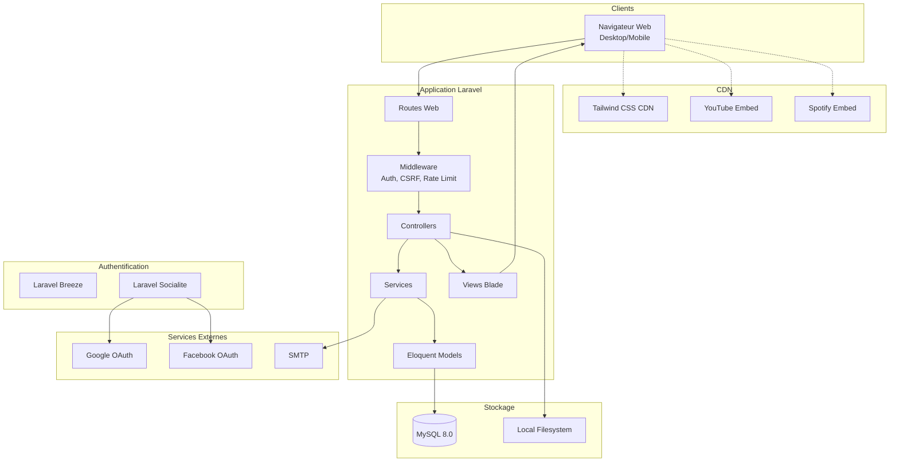
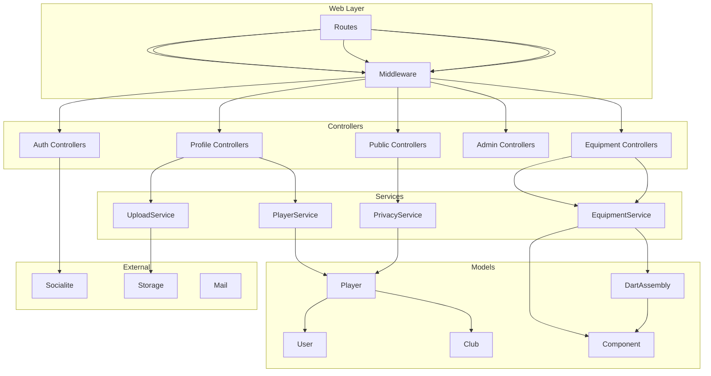
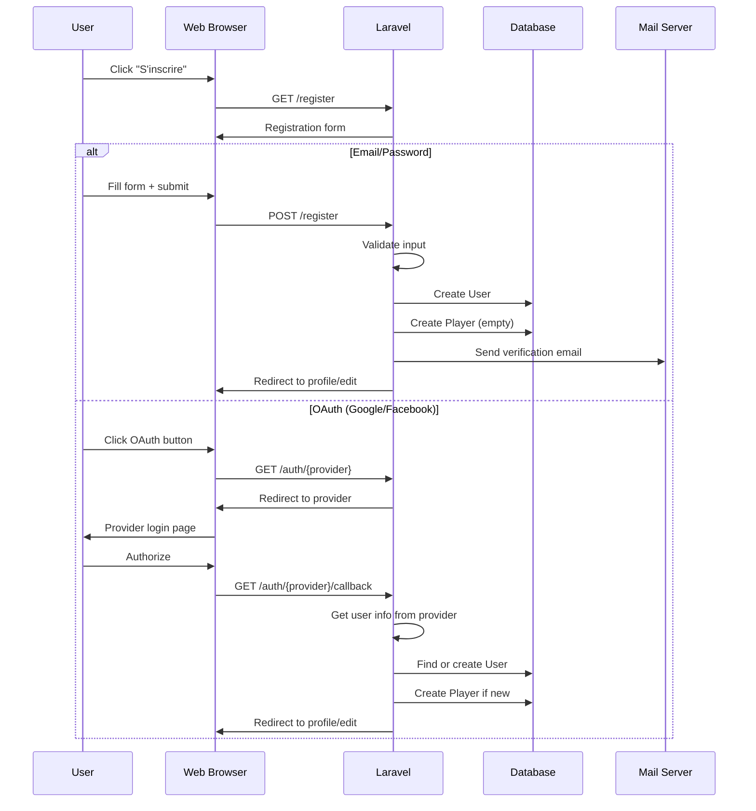
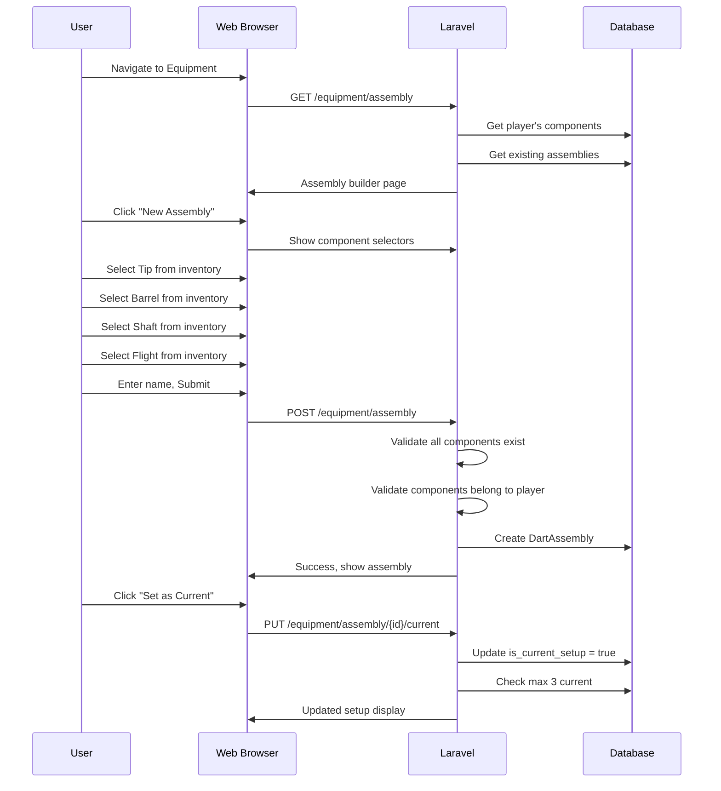
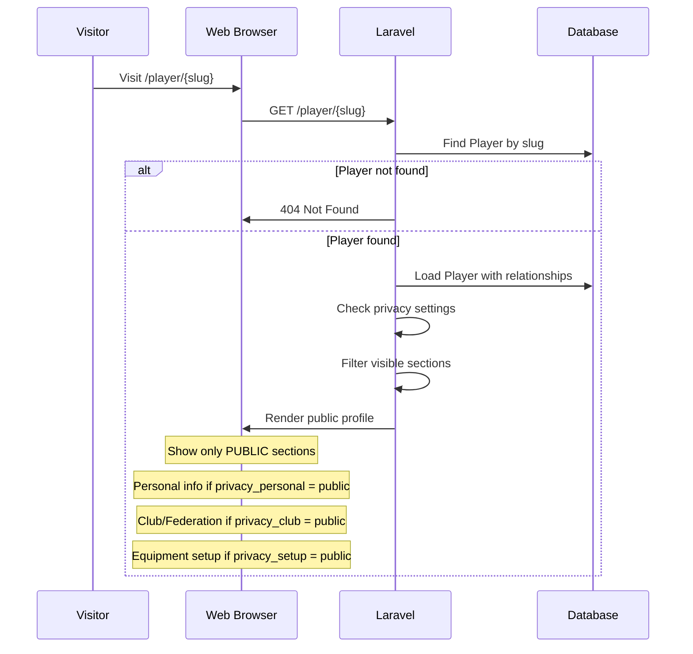
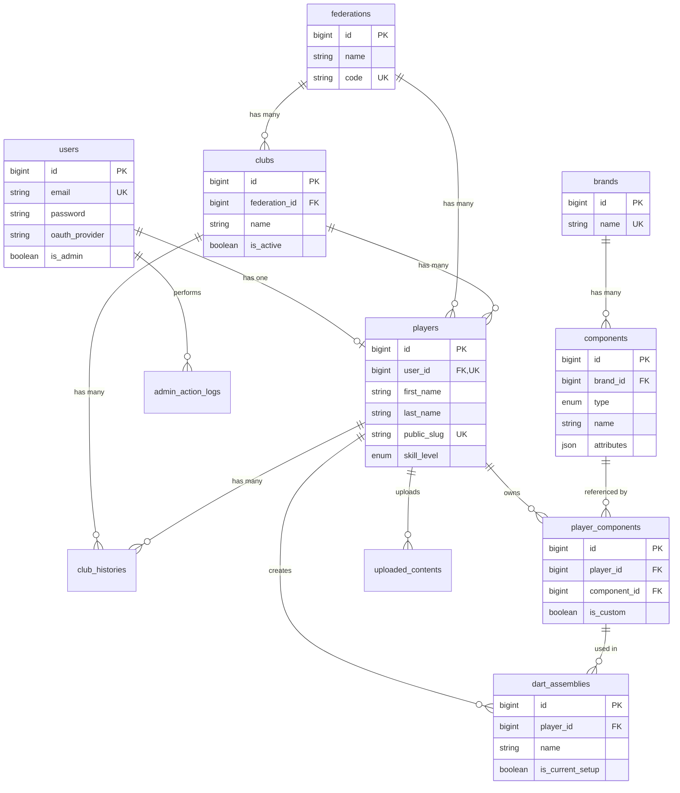
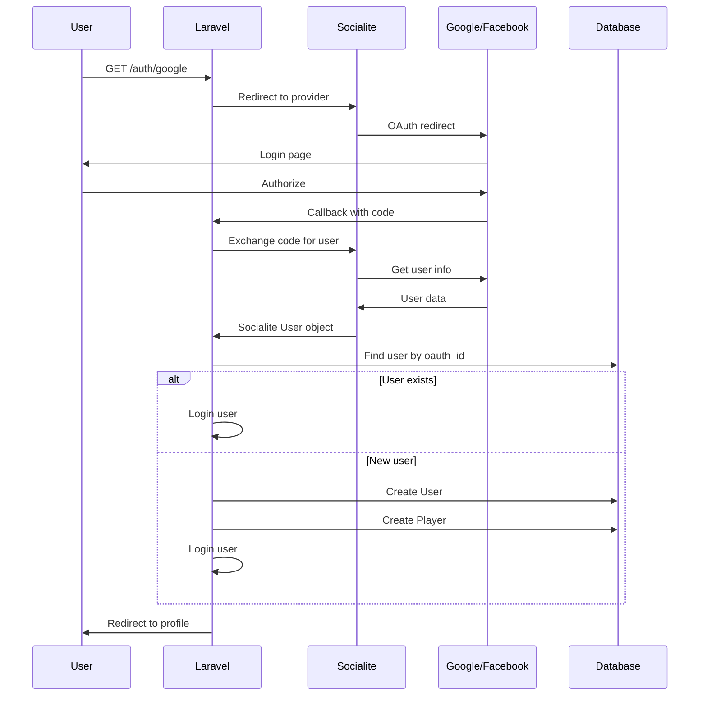

# Darts Community - Fullstack Architecture Document

> **Version:** 1.0
> **Date:** 2026-01-08
> **Status:** Draft - En cours de validation

---

## 1. Introduction

Ce document définit l'architecture technique complète de **Darts Community**, une plateforme web pour les joueurs de fléchettes amateurs francophones. Il sert de source unique de vérité pour le développement assisté par IA.

### 1.1 Starter Template ou Projet Existant

**N/A - Projet Greenfield**

Ce projet démarre de zéro avec une installation Laravel standard. Les choix technologiques sont définis dans le PRD :
- Laravel 11+ monolithique
- Blade + Tailwind CSS (CDN)
- Laravel Herd pour le développement local
- Pas de build process frontend

### 1.2 Change Log

| Date | Version | Description | Author |
|------|---------|-------------|--------|
| 2026-01-08 | 1.0 | Architecture initiale complète | Winston (Architect) |

---

## 2. High Level Architecture

### 2.1 Technical Summary

**Darts Community** est une application web monolithique Laravel 11+ conçue pour servir la communauté francophone des joueurs de fléchettes amateurs. L'architecture suit le pattern MVC traditionnel de Laravel avec rendu côté serveur via Blade et styling via Tailwind CSS CDN.

L'application utilise une authentification hybride (session-based) combinant Laravel Breeze pour email/password et Socialite pour OAuth (Google, Facebook). Le stockage des fichiers (photos, MP3) est abstrait via le filesystem Laravel, permettant une migration future vers S3.

Le système d'équipement modulaire constitue le cœur métier différenciateur, avec un modèle de données relationnel permettant l'assemblage de composants en configurations de fléchettes complètes.

### 2.2 Platform and Infrastructure Choice

**Platform:** o2switch - Hébergement mutualisé PHP (compte existant)
**Key Services:** PHP 8.2+, MySQL 8.0, Let's Encrypt SSL, SMTP o2switch
**Domain:** dartscommunity.com
**Deployment Host and Regions:** France (datacenter o2switch)
**Isolation:** Lune dédiée pour isoler le projet

**Rationale:** Compte o2switch existant, infrastructure éprouvée, SMTP inclus, support français. Migration vers VPS possible si croissance.

### 2.3 Repository Structure

**Structure:** Monorepo simple
**Monorepo Tool:** N/A (application Laravel standard)
**Package Organization:** Structure Laravel conventionnelle

```
darts-community/
├── app/                    # Code applicatif
│   ├── Http/
│   │   ├── Controllers/
│   │   ├── Middleware/
│   │   └── Requests/
│   ├── Models/
│   ├── Services/
│   ├── Policies/
│   └── Observers/
├── bootstrap/
├── config/
├── database/
│   ├── factories/
│   ├── migrations/
│   └── seeders/
├── docs/
├── public/
├── resources/
│   ├── css/
│   ├── js/
│   └── views/
├── routes/
├── storage/
├── tests/
└── vendor/
```

### 2.4 High Level Architecture Diagram



### 2.5 Architectural Patterns

- **MVC (Model-View-Controller):** Architecture Laravel native - _Rationale:_ Standard, bien documenté, facilite la maintenance
- **Service Layer:** Logique métier dans classes Service - _Rationale:_ Controllers minces, réutilisabilité
- **Form Requests:** Validation centralisée - _Rationale:_ Séparation des responsabilités
- **Policy-based Authorization:** Contrôle d'accès via Policies - _Rationale:_ Centralise l'autorisation
- **Observer Pattern:** Événements sur les modèles - _Rationale:_ Découplage, extensibilité
- **Filesystem Abstraction:** Storage facade Laravel - _Rationale:_ Migration S3 transparente

---

## 3. Tech Stack

### 3.1 Technology Stack Table

| Category | Technology | Version | Purpose | Rationale |
|----------|------------|---------|---------|-----------|
| Backend Language | PHP | 8.2+ | Langage serveur | Requis par Laravel 11, features modernes |
| Backend Framework | Laravel | 11.x | Framework web | Écosystème riche, Eloquent ORM, blade templating |
| Frontend Language | JavaScript | ES6+ | Interactivité légère | Vanilla JS suffit, pas de build nécessaire |
| Frontend Framework | Blade | - | Templating | Intégré Laravel, SEO-friendly, SSR natif |
| UI Component Library | N/A | - | - | Composants Blade custom |
| CSS Framework | Tailwind CSS | 3.x (CDN) | Styling utility-first | Pas de build, CDN Play pour MVP |
| State Management | N/A | - | - | SSR, pas de state frontend complexe |
| API Style | Internal REST | - | Routes Laravel internes | Prépare API future, conventions REST |
| Database | MySQL | 8.0 | Base relationnelle | Relationnel adapté au domaine, support FR |
| Cache | File/Database | - | Cache applicatif | Laravel cache, Redis possible plus tard |
| File Storage | Local Filesystem | - | Photos, MP3 | Migration S3 préparée via Storage facade |
| Authentication | Laravel Breeze + Socialite | - | Auth session-based | Email/password + OAuth Google/Facebook |
| Backend Testing | PHPUnit | 10.x | Tests unitaires/feature | Standard Laravel |
| E2E Testing | Laravel Dusk | - | Tests navigateur (optionnel) | Si besoin tests critiques UI |
| Build Tool | N/A | - | - | Pas de build process |
| Bundler | N/A | - | - | CDN pour assets |
| IaC Tool | N/A | - | - | Déploiement manuel MVP |
| CI/CD | N/A | - | - | Manuel pour MVP |
| Monitoring | Laravel Telescope | - | Debug/monitoring dev | Optionnel en prod |
| Logging | Laravel Log | - | Logs applicatifs | Fichiers logs standard |

---

## 4. Data Models

### 4.1 User

**Purpose:** Compte utilisateur pour authentification et gestion de compte

**Key Attributes:**
- id: bigint unsigned - Identifiant unique
- email: string - Email unique pour login
- password: string nullable - Hash password (null si OAuth only)
- oauth_provider: string nullable - google, facebook, ou null
- oauth_id: string nullable - ID du provider OAuth
- is_admin: boolean - Rôle administrateur
- email_verified_at: timestamp nullable - Vérification email
- created_at/updated_at: timestamps

**TypeScript Interface (pour référence API future):**
```typescript
interface User {
  id: number;
  email: string;
  isAdmin: boolean;
  emailVerifiedAt: string | null;
  createdAt: string;
  updatedAt: string;
}
```

**Relationships:**
- hasOne Player
- hasMany AdminActionLog (as actor)

---

### 4.2 Player

**Purpose:** Profil joueur de fléchettes avec identité et préférences

**Key Attributes:**
- id: bigint unsigned - Identifiant unique
- user_id: bigint unsigned - Lien vers User
- first_name: string - Prénom
- last_name: string - Nom
- nickname: string nullable - Pseudo (non unique, simple display name)
- date_of_birth: date nullable - Date de naissance
- city: string nullable - Ville
- skill_level: enum - Débutant, Amateur, Confirmé, Semi-pro, Pro
- profile_photo_path: string nullable - Chemin photo profil
- cover_photo_path: string nullable - Chemin photo couverture
- walkon_song_type: enum nullable - youtube, spotify, mp3
- walkon_song_url: string nullable - URL embed ou chemin fichier
- club_id: bigint unsigned nullable - Club actuel
- federation_id: bigint unsigned nullable - Fédération
- license_number: string nullable - Numéro de licence
- privacy_personal: enum - public, private
- privacy_club: enum - public, private
- privacy_setup: enum - public, private
- email_visible: boolean - Visibilité email
- public_slug: string unique - URL publique unique

**TypeScript Interface:**
```typescript
interface Player {
  id: number;
  userId: number;
  firstName: string;
  lastName: string;
  nickname: string | null;
  dateOfBirth: string | null;
  city: string | null;
  skillLevel: 'debutant' | 'amateur' | 'confirme' | 'semi-pro' | 'pro';
  profilePhotoUrl: string | null;
  coverPhotoUrl: string | null;
  walkonSong: {
    type: 'youtube' | 'spotify' | 'mp3' | null;
    url: string | null;
  };
  club: Club | null;
  federation: Federation | null;
  licenseNumber: string | null;
  publicSlug: string;
}
```

**Relationships:**
- belongsTo User
- belongsTo Club (nullable)
- belongsTo Federation (nullable)
- hasMany PlayerComponent
- hasMany DartAssembly
- hasMany ClubHistory

---

### 4.3 Federation

**Purpose:** Fédération officielle de fléchettes (FFD, etc.)

**Key Attributes:**
- id: bigint unsigned
- name: string - Nom complet
- code: string - Code court (FFD)
- country: string - Pays

**Relationships:**
- hasMany Club
- hasMany Player

---

### 4.4 Club

**Purpose:** Club de fléchettes affilié à une fédération

**Key Attributes:**
- id: bigint unsigned
- name: string - Nom du club
- city: string nullable - Ville
- federation_id: bigint unsigned nullable
- is_active: boolean - Actif ou archivé

**Relationships:**
- belongsTo Federation (nullable)
- hasMany Player

---

### 4.5 ClubHistory

**Purpose:** Historique des affiliations club d'un joueur

**Key Attributes:**
- id: bigint unsigned
- player_id: bigint unsigned
- club_id: bigint unsigned
- joined_at: date
- left_at: date nullable

**Relationships:**
- belongsTo Player
- belongsTo Club

---

### 4.6 Brand

**Purpose:** Marque d'équipement de fléchettes

**Key Attributes:**
- id: bigint unsigned
- name: string - Nom de la marque
- logo_path: string nullable
- website: string nullable

**Relationships:**
- hasMany Component

---

### 4.7 Component

**Purpose:** Composant de fléchette du catalogue (pointe, fût, tige, ailette)

**Key Attributes:**
- id: bigint unsigned
- brand_id: bigint unsigned
- type: enum - tip, barrel, shaft, flight
- name: string - Nom du modèle
- attributes: json - Attributs spécifiques au type
- image_path: string nullable

**Attributes JSON par type:**
```json
// Tip (Pointe)
{ "tip_type": "steel|soft", "length": "25mm" }

// Barrel (Fût)
{ "weight": "24g", "material": "tungsten", "grip_style": "ringed" }

// Shaft (Tige)
{ "length": "medium", "material": "aluminum" }

// Flight (Ailette)
{ "shape": "standard", "thickness": "100" }
```

**Relationships:**
- belongsTo Brand
- hasMany PlayerComponent

---

### 4.8 PlayerComponent

**Purpose:** Composant dans l'inventaire personnel d'un joueur

**Key Attributes:**
- id: bigint unsigned
- player_id: bigint unsigned
- component_id: bigint unsigned nullable - Null si custom
- is_custom: boolean
- custom_brand: string nullable
- custom_name: string nullable
- custom_type: enum nullable
- custom_attributes: json nullable
- custom_image_path: string nullable

**Relationships:**
- belongsTo Player
- belongsTo Component (nullable)

---

### 4.9 DartAssembly

**Purpose:** Configuration complète d'une fléchette assemblée

**Key Attributes:**
- id: bigint unsigned
- player_id: bigint unsigned
- name: string - Nom de la config ("Match Darts")
- tip_component_id: bigint unsigned - PlayerComponent
- barrel_component_id: bigint unsigned
- shaft_component_id: bigint unsigned
- flight_component_id: bigint unsigned
- is_current_setup: boolean
- display_order: int nullable

**Relationships:**
- belongsTo Player
- belongsTo PlayerComponent (tip, barrel, shaft, flight)

---

### 4.10 AdminActionLog

**Purpose:** Journal des actions administrateur

**Key Attributes:**
- id: bigint unsigned
- admin_user_id: bigint unsigned
- action_type: string - suspend_user, delete_user, etc.
- target_type: string - User, Player, etc.
- target_id: bigint unsigned
- details: json nullable
- created_at: timestamp

**Relationships:**
- belongsTo User (as admin)

---

### 4.11 UploadedContent

**Purpose:** Suivi des contenus uploadés pour modération

**Key Attributes:**
- id: bigint unsigned
- player_id: bigint unsigned
- content_type: enum - profile_photo, cover_photo, walkon_mp3, component_photo
- file_path: string
- status: enum - pending, approved, flagged, removed
- moderated_by: bigint unsigned nullable
- moderated_at: timestamp nullable
- removal_reason: string nullable

**Relationships:**
- belongsTo Player
- belongsTo User (moderator, nullable)

---

## 5. API Specification

L'application MVP utilise principalement des routes web Laravel (pas d'API REST séparée). Cependant, la structure prépare une future API.

### 5.1 Routes Web Principales

```yaml
# Routes Publiques
GET  /                          # Landing page
GET  /player/{slug}             # Profil public

# Routes Auth (Breeze)
GET  /login                     # Formulaire connexion
POST /login                     # Traitement connexion
GET  /register                  # Formulaire inscription
POST /register                  # Traitement inscription
POST /logout                    # Déconnexion
GET  /forgot-password           # Mot de passe oublié
POST /forgot-password           # Envoi email reset
GET  /reset-password/{token}    # Formulaire reset
POST /reset-password            # Traitement reset

# Routes OAuth
GET  /auth/google               # Redirect vers Google
GET  /auth/google/callback      # Callback Google
GET  /auth/facebook             # Redirect vers Facebook
GET  /auth/facebook/callback    # Callback Facebook

# Routes Authentifiées - Profil
GET  /profile                   # Mon profil (vue)
GET  /profile/edit              # Édition profil
PUT  /profile                   # Mise à jour profil
POST /profile/photo             # Upload photo profil
POST /profile/cover             # Upload photo couverture
DELETE /profile/photo           # Supprimer photo profil
DELETE /profile/cover           # Supprimer photo couverture

# Routes Authentifiées - Équipement
GET  /equipment                 # Mon inventaire
GET  /equipment/catalog         # Catalogue (recherche)
POST /equipment/component       # Ajouter composant
POST /equipment/custom          # Ajouter composant custom
DELETE /equipment/component/{id}# Retirer composant
GET  /equipment/assembly        # Mes assemblages
POST /equipment/assembly        # Créer assemblage
PUT  /equipment/assembly/{id}   # Modifier assemblage
DELETE /equipment/assembly/{id} # Supprimer assemblage
PUT  /equipment/assembly/{id}/current  # Définir comme setup actuel

# Routes Authentifiées - Paramètres
GET  /settings                  # Paramètres compte
PUT  /settings/email            # Modifier email
PUT  /settings/password         # Modifier mot de passe
PUT  /settings/privacy          # Modifier confidentialité
GET  /settings/export           # Exporter données (GDPR)
DELETE /settings/account        # Supprimer compte

# Routes Admin
GET  /admin                     # Dashboard admin
GET  /admin/users               # Liste utilisateurs
GET  /admin/users/{id}          # Détail utilisateur
PUT  /admin/users/{id}          # Modifier utilisateur
POST /admin/users/{id}/suspend  # Suspendre
POST /admin/users/{id}/activate # Réactiver
POST /admin/users/{id}/reset-password  # Forcer reset
DELETE /admin/users/{id}        # Supprimer
POST /admin/users/{id}/promote  # Promouvoir admin
POST /admin/users/{id}/demote   # Révoquer admin

GET  /admin/brands              # Liste marques
POST /admin/brands              # Créer marque
PUT  /admin/brands/{id}         # Modifier marque
DELETE /admin/brands/{id}       # Supprimer marque

GET  /admin/components          # Liste composants
POST /admin/components          # Créer composant
PUT  /admin/components/{id}     # Modifier composant
DELETE /admin/components/{id}   # Supprimer composant

GET  /admin/clubs               # Liste clubs
POST /admin/clubs               # Créer club
PUT  /admin/clubs/{id}          # Modifier club
DELETE /admin/clubs/{id}        # Supprimer club
POST /admin/clubs/import        # Import CSV
POST /admin/clubs/{id}/merge    # Fusionner clubs

GET  /admin/federations         # Liste fédérations
POST /admin/federations         # Créer fédération
PUT  /admin/federations/{id}    # Modifier fédération

GET  /admin/moderation          # File de modération
PUT  /admin/moderation/{id}     # Action modération
```

---

## 6. Components

### 6.1 Authentication Component

**Responsibility:** Gestion de l'authentification utilisateur (email/password + OAuth)

**Key Interfaces:**
- `AuthController` - Gestion login/register/logout
- `SocialiteController` - Callbacks OAuth
- `PasswordResetController` - Reset password flow

**Dependencies:** Laravel Breeze, Laravel Socialite

**Technology Stack:** PHP, Laravel Auth, Session driver

---

### 6.2 Profile Component

**Responsibility:** Gestion du profil joueur (CRUD, photos, walk-on song)

**Key Interfaces:**
- `ProfileController` - CRUD profil
- `ProfilePhotoController` - Upload/delete photos
- `WalkonSongController` - Configuration walk-on song
- `PlayerService` - Logique métier profil

**Dependencies:** Storage facade, Image intervention (optionnel)

**Technology Stack:** PHP, Laravel Storage, Blade views

---

### 6.3 Equipment Component

**Responsibility:** Gestion de l'inventaire et assemblage de fléchettes

**Key Interfaces:**
- `EquipmentController` - Inventaire joueur
- `CatalogController` - Recherche catalogue
- `AssemblyController` - Assemblage fléchettes
- `EquipmentService` - Logique métier équipement

**Dependencies:** Profile Component (Player model)

**Technology Stack:** PHP, Eloquent relationships, Blade views

---

### 6.4 Club & Federation Component

**Responsibility:** Gestion des affiliations clubs et fédérations

**Key Interfaces:**
- `ClubController` - Sélection club
- `ClubHistoryService` - Historique affiliations

**Dependencies:** Profile Component

**Technology Stack:** PHP, Eloquent

---

### 6.5 Privacy Component

**Responsibility:** Gestion des paramètres de confidentialité et profil public

**Key Interfaces:**
- `PrivacyController` - Settings privacy
- `PublicProfileController` - Vue profil public
- `PrivacyService` - Filtrage données selon settings

**Dependencies:** Profile Component

**Technology Stack:** PHP, Blade conditionals

---

### 6.6 Admin Component

**Responsibility:** Back-office administration complet

**Key Interfaces:**
- `AdminDashboardController` - Métriques et KPIs
- `AdminUserController` - Gestion utilisateurs
- `AdminCatalogController` - Gestion catalogue
- `AdminModerationController` - Modération contenu
- `AdminClubController` - Gestion clubs/fédérations

**Dependencies:** Tous les autres components

**Technology Stack:** PHP, Laravel Policies, Admin middleware

---

### 6.7 Component Diagram



---

## 7. Core Workflows

### 7.1 User Registration Flow



### 7.2 Equipment Assembly Flow



### 7.3 Public Profile View Flow



---

## 8. Database Schema

### 8.1 Complete Schema (MySQL)

```sql
-- Users table (extends Laravel default)
CREATE TABLE users (
    id BIGINT UNSIGNED AUTO_INCREMENT PRIMARY KEY,
    email VARCHAR(255) UNIQUE NOT NULL,
    password VARCHAR(255) NULL,
    oauth_provider VARCHAR(50) NULL,
    oauth_id VARCHAR(255) NULL,
    is_admin BOOLEAN DEFAULT FALSE,
    is_suspended BOOLEAN DEFAULT FALSE,
    email_verified_at TIMESTAMP NULL,
    remember_token VARCHAR(100) NULL,
    created_at TIMESTAMP NULL,
    updated_at TIMESTAMP NULL,
    deleted_at TIMESTAMP NULL,

    INDEX idx_oauth (oauth_provider, oauth_id),
    INDEX idx_email (email)
);

-- Federations
CREATE TABLE federations (
    id BIGINT UNSIGNED AUTO_INCREMENT PRIMARY KEY,
    name VARCHAR(255) NOT NULL,
    code VARCHAR(10) NOT NULL UNIQUE,
    country VARCHAR(100) DEFAULT 'France',
    created_at TIMESTAMP NULL,
    updated_at TIMESTAMP NULL
);

-- Clubs
CREATE TABLE clubs (
    id BIGINT UNSIGNED AUTO_INCREMENT PRIMARY KEY,
    federation_id BIGINT UNSIGNED NULL,
    name VARCHAR(255) NOT NULL,
    city VARCHAR(255) NULL,
    is_active BOOLEAN DEFAULT TRUE,
    created_at TIMESTAMP NULL,
    updated_at TIMESTAMP NULL,

    FOREIGN KEY (federation_id) REFERENCES federations(id) ON DELETE SET NULL,
    INDEX idx_federation (federation_id),
    INDEX idx_active (is_active)
);

-- Players
CREATE TABLE players (
    id BIGINT UNSIGNED AUTO_INCREMENT PRIMARY KEY,
    user_id BIGINT UNSIGNED UNIQUE NOT NULL,
    first_name VARCHAR(100) NULL,
    last_name VARCHAR(100) NULL,
    nickname VARCHAR(100) NULL,
    date_of_birth DATE NULL,
    city VARCHAR(255) NULL,
    skill_level ENUM('debutant', 'amateur', 'confirme', 'semi-pro', 'pro') NULL,
    profile_photo_path VARCHAR(255) NULL,
    cover_photo_path VARCHAR(255) NULL,
    walkon_song_type ENUM('youtube', 'spotify', 'mp3') NULL,
    walkon_song_url TEXT NULL,
    club_id BIGINT UNSIGNED NULL,
    federation_id BIGINT UNSIGNED NULL,
    license_number VARCHAR(50) NULL,
    privacy_personal ENUM('public', 'private') DEFAULT 'public',
    privacy_club ENUM('public', 'private') DEFAULT 'public',
    privacy_setup ENUM('public', 'private') DEFAULT 'public',
    email_visible BOOLEAN DEFAULT FALSE,
    public_slug VARCHAR(100) UNIQUE NOT NULL,
    created_at TIMESTAMP NULL,
    updated_at TIMESTAMP NULL,

    FOREIGN KEY (user_id) REFERENCES users(id) ON DELETE CASCADE,
    FOREIGN KEY (club_id) REFERENCES clubs(id) ON DELETE SET NULL,
    FOREIGN KEY (federation_id) REFERENCES federations(id) ON DELETE SET NULL,
    INDEX idx_public_slug (public_slug),
    INDEX idx_club (club_id)
);

-- Club History
CREATE TABLE club_histories (
    id BIGINT UNSIGNED AUTO_INCREMENT PRIMARY KEY,
    player_id BIGINT UNSIGNED NOT NULL,
    club_id BIGINT UNSIGNED NOT NULL,
    joined_at DATE NOT NULL,
    left_at DATE NULL,
    created_at TIMESTAMP NULL,
    updated_at TIMESTAMP NULL,

    FOREIGN KEY (player_id) REFERENCES players(id) ON DELETE CASCADE,
    FOREIGN KEY (club_id) REFERENCES clubs(id) ON DELETE CASCADE,
    INDEX idx_player (player_id)
);

-- Brands
CREATE TABLE brands (
    id BIGINT UNSIGNED AUTO_INCREMENT PRIMARY KEY,
    name VARCHAR(255) NOT NULL UNIQUE,
    logo_path VARCHAR(255) NULL,
    website VARCHAR(255) NULL,
    created_at TIMESTAMP NULL,
    updated_at TIMESTAMP NULL
);

-- Components (Catalog)
CREATE TABLE components (
    id BIGINT UNSIGNED AUTO_INCREMENT PRIMARY KEY,
    brand_id BIGINT UNSIGNED NOT NULL,
    type ENUM('tip', 'barrel', 'shaft', 'flight') NOT NULL,
    name VARCHAR(255) NOT NULL,
    attributes JSON NULL,
    image_path VARCHAR(255) NULL,
    created_at TIMESTAMP NULL,
    updated_at TIMESTAMP NULL,

    FOREIGN KEY (brand_id) REFERENCES brands(id) ON DELETE CASCADE,
    INDEX idx_brand_type (brand_id, type),
    INDEX idx_type (type)
);

-- Player Components (Inventory)
CREATE TABLE player_components (
    id BIGINT UNSIGNED AUTO_INCREMENT PRIMARY KEY,
    player_id BIGINT UNSIGNED NOT NULL,
    component_id BIGINT UNSIGNED NULL,
    is_custom BOOLEAN DEFAULT FALSE,
    custom_brand VARCHAR(255) NULL,
    custom_name VARCHAR(255) NULL,
    custom_type ENUM('tip', 'barrel', 'shaft', 'flight') NULL,
    custom_attributes JSON NULL,
    custom_image_path VARCHAR(255) NULL,
    created_at TIMESTAMP NULL,
    updated_at TIMESTAMP NULL,

    FOREIGN KEY (player_id) REFERENCES players(id) ON DELETE CASCADE,
    FOREIGN KEY (component_id) REFERENCES components(id) ON DELETE SET NULL,
    INDEX idx_player (player_id),
    INDEX idx_player_type (player_id, is_custom)
);

-- Dart Assemblies
CREATE TABLE dart_assemblies (
    id BIGINT UNSIGNED AUTO_INCREMENT PRIMARY KEY,
    player_id BIGINT UNSIGNED NOT NULL,
    name VARCHAR(255) NOT NULL,
    tip_component_id BIGINT UNSIGNED NOT NULL,
    barrel_component_id BIGINT UNSIGNED NOT NULL,
    shaft_component_id BIGINT UNSIGNED NOT NULL,
    flight_component_id BIGINT UNSIGNED NOT NULL,
    is_current_setup BOOLEAN DEFAULT FALSE,
    display_order TINYINT UNSIGNED NULL,
    created_at TIMESTAMP NULL,
    updated_at TIMESTAMP NULL,

    FOREIGN KEY (player_id) REFERENCES players(id) ON DELETE CASCADE,
    FOREIGN KEY (tip_component_id) REFERENCES player_components(id) ON DELETE CASCADE,
    FOREIGN KEY (barrel_component_id) REFERENCES player_components(id) ON DELETE CASCADE,
    FOREIGN KEY (shaft_component_id) REFERENCES player_components(id) ON DELETE CASCADE,
    FOREIGN KEY (flight_component_id) REFERENCES player_components(id) ON DELETE CASCADE,
    INDEX idx_player_current (player_id, is_current_setup)
);

-- Admin Action Logs
CREATE TABLE admin_action_logs (
    id BIGINT UNSIGNED AUTO_INCREMENT PRIMARY KEY,
    admin_user_id BIGINT UNSIGNED NOT NULL,
    action_type VARCHAR(50) NOT NULL,
    target_type VARCHAR(50) NOT NULL,
    target_id BIGINT UNSIGNED NOT NULL,
    details JSON NULL,
    created_at TIMESTAMP NULL,

    FOREIGN KEY (admin_user_id) REFERENCES users(id) ON DELETE CASCADE,
    INDEX idx_admin (admin_user_id),
    INDEX idx_target (target_type, target_id),
    INDEX idx_created (created_at)
);

-- Uploaded Content (Moderation)
CREATE TABLE uploaded_contents (
    id BIGINT UNSIGNED AUTO_INCREMENT PRIMARY KEY,
    player_id BIGINT UNSIGNED NOT NULL,
    content_type ENUM('profile_photo', 'cover_photo', 'walkon_mp3', 'component_photo') NOT NULL,
    file_path VARCHAR(255) NOT NULL,
    status ENUM('pending', 'approved', 'flagged', 'removed') DEFAULT 'approved',
    moderated_by BIGINT UNSIGNED NULL,
    moderated_at TIMESTAMP NULL,
    removal_reason TEXT NULL,
    created_at TIMESTAMP NULL,
    updated_at TIMESTAMP NULL,

    FOREIGN KEY (player_id) REFERENCES players(id) ON DELETE CASCADE,
    FOREIGN KEY (moderated_by) REFERENCES users(id) ON DELETE SET NULL,
    INDEX idx_status (status),
    INDEX idx_player (player_id)
);

-- Password Reset Tokens (Laravel default)
CREATE TABLE password_reset_tokens (
    email VARCHAR(255) PRIMARY KEY,
    token VARCHAR(255) NOT NULL,
    created_at TIMESTAMP NULL
);

-- Sessions (Laravel default)
CREATE TABLE sessions (
    id VARCHAR(255) PRIMARY KEY,
    user_id BIGINT UNSIGNED NULL,
    ip_address VARCHAR(45) NULL,
    user_agent TEXT NULL,
    payload LONGTEXT NOT NULL,
    last_activity INT NOT NULL,

    INDEX idx_user (user_id),
    INDEX idx_last_activity (last_activity)
);
```

### 8.2 Entity Relationship Diagram



---

## 9. Frontend Architecture

### 9.1 Component Organization

L'architecture frontend utilise Blade avec une organisation par composants réutilisables.

```
resources/views/
├── layouts/
│   ├── app.blade.php           # Layout principal authentifié
│   ├── guest.blade.php         # Layout visiteur/auth
│   └── admin.blade.php         # Layout admin
├── components/
│   ├── forms/
│   │   ├── input.blade.php
│   │   ├── select.blade.php
│   │   ├── textarea.blade.php
│   │   └── file-upload.blade.php
│   ├── ui/
│   │   ├── button.blade.php
│   │   ├── card.blade.php
│   │   ├── modal.blade.php
│   │   ├── badge.blade.php
│   │   └── alert.blade.php
│   ├── profile/
│   │   ├── avatar.blade.php
│   │   ├── cover-photo.blade.php
│   │   ├── skill-badge.blade.php
│   │   └── walkon-player.blade.php
│   └── equipment/
│       ├── component-card.blade.php
│       ├── assembly-builder.blade.php
│       └── setup-display.blade.php
├── pages/
│   ├── home.blade.php
│   ├── profile/
│   │   ├── show.blade.php
│   │   └── edit.blade.php
│   ├── equipment/
│   │   ├── index.blade.php
│   │   └── assembly.blade.php
│   ├── settings/
│   │   └── index.blade.php
│   └── public/
│       └── player.blade.php
├── admin/
│   ├── dashboard.blade.php
│   ├── users/
│   ├── catalog/
│   ├── moderation/
│   └── clubs/
└── auth/
    ├── login.blade.php
    ├── register.blade.php
    └── ...
```

### 9.2 Blade Component Template

```php
{{-- resources/views/components/ui/card.blade.php --}}
@props([
    'title' => null,
    'subtitle' => null,
    'padding' => true
])

<div {{ $attributes->merge(['class' => 'bg-white rounded-lg shadow-md overflow-hidden']) }}>
    @if($title)
        <div class="px-6 py-4 border-b border-gray-200">
            <h3 class="text-lg font-semibold text-gray-900">{{ $title }}</h3>
            @if($subtitle)
                <p class="text-sm text-gray-500">{{ $subtitle }}</p>
            @endif
        </div>
    @endif

    <div @class(['px-6 py-4' => $padding])>
        {{ $slot }}
    </div>
</div>
```

### 9.3 State Management Patterns

L'application utilise des approches simples sans framework JS :

- **Session Flash Messages:** Pour notifications utilisateur
- **Alpine.js (optionnel):** Pour interactions légères (modals, dropdowns)
- **Livewire (optionnel futur):** Si besoin d'interactivité sans rechargement

```javascript
// resources/js/app.js - JavaScript vanilla minimal
document.addEventListener('DOMContentLoaded', function() {
    // Auto-dismiss flash messages
    const alerts = document.querySelectorAll('[data-auto-dismiss]');
    alerts.forEach(alert => {
        setTimeout(() => {
            alert.remove();
        }, 5000);
    });

    // File upload preview
    document.querySelectorAll('[data-file-preview]').forEach(input => {
        input.addEventListener('change', function(e) {
            const preview = document.getElementById(this.dataset.filePreview);
            if (preview && this.files[0]) {
                preview.src = URL.createObjectURL(this.files[0]);
            }
        });
    });
});
```

### 9.4 Routing Architecture

```
routes/
├── web.php           # Routes principales
├── auth.php          # Routes authentification (Breeze)
└── admin.php         # Routes admin (préfixées /admin)
```

```php
// routes/web.php
Route::get('/', [HomeController::class, 'index'])->name('home');
Route::get('/player/{slug}', [PublicProfileController::class, 'show'])->name('player.public');

Route::middleware(['auth', 'verified'])->group(function () {
    Route::get('/profile', [ProfileController::class, 'show'])->name('profile.show');
    Route::get('/profile/edit', [ProfileController::class, 'edit'])->name('profile.edit');
    Route::put('/profile', [ProfileController::class, 'update'])->name('profile.update');

    Route::resource('equipment', EquipmentController::class);
    Route::resource('assembly', AssemblyController::class);

    Route::prefix('settings')->name('settings.')->group(function () {
        Route::get('/', [SettingsController::class, 'index'])->name('index');
        Route::put('/privacy', [SettingsController::class, 'updatePrivacy'])->name('privacy');
    });
});
```

### 9.5 Protected Route Pattern

```php
// app/Http/Middleware/EnsureProfileComplete.php
class EnsureProfileComplete
{
    public function handle(Request $request, Closure $next): Response
    {
        if (auth()->check() && !auth()->user()->player->isComplete()) {
            return redirect()->route('profile.edit')
                ->with('warning', 'Veuillez compléter votre profil.');
        }

        return $next($request);
    }
}
```

---

## 10. Backend Architecture

### 10.1 Service Architecture

```
app/
├── Http/
│   ├── Controllers/
│   │   ├── Auth/
│   │   │   ├── LoginController.php
│   │   │   ├── RegisterController.php
│   │   │   └── SocialiteController.php
│   │   ├── ProfileController.php
│   │   ├── EquipmentController.php
│   │   ├── AssemblyController.php
│   │   ├── SettingsController.php
│   │   ├── PublicProfileController.php
│   │   └── Admin/
│   │       ├── DashboardController.php
│   │       ├── UserController.php
│   │       ├── CatalogController.php
│   │       └── ModerationController.php
│   ├── Middleware/
│   │   ├── AdminMiddleware.php
│   │   └── EnsureProfileComplete.php
│   └── Requests/
│       ├── ProfileUpdateRequest.php
│       ├── ComponentRequest.php
│       └── AssemblyRequest.php
├── Models/
│   ├── User.php
│   ├── Player.php
│   ├── Club.php
│   ├── Federation.php
│   ├── Brand.php
│   ├── Component.php
│   ├── PlayerComponent.php
│   ├── DartAssembly.php
│   └── AdminActionLog.php
├── Services/
│   ├── PlayerService.php
│   ├── EquipmentService.php
│   ├── UploadService.php
│   └── PrivacyService.php
├── Policies/
│   ├── PlayerPolicy.php
│   ├── ComponentPolicy.php
│   └── AssemblyPolicy.php
└── Observers/
    ├── UserObserver.php
    └── PlayerObserver.php
```

### 10.2 Controller Template

```php
<?php

namespace App\Http\Controllers;

use App\Http\Requests\ProfileUpdateRequest;
use App\Services\PlayerService;
use App\Services\UploadService;
use Illuminate\Http\RedirectResponse;
use Illuminate\View\View;

class ProfileController extends Controller
{
    public function __construct(
        private PlayerService $playerService,
        private UploadService $uploadService
    ) {}

    public function show(): View
    {
        $player = auth()->user()->player->load(['club', 'federation', 'currentSetup']);

        return view('pages.profile.show', compact('player'));
    }

    public function edit(): View
    {
        $player = auth()->user()->player;
        $clubs = Club::active()->orderBy('name')->get();
        $federations = Federation::all();

        return view('pages.profile.edit', compact('player', 'clubs', 'federations'));
    }

    public function update(ProfileUpdateRequest $request): RedirectResponse
    {
        $this->playerService->updateProfile(
            auth()->user()->player,
            $request->validated()
        );

        return redirect()
            ->route('profile.show')
            ->with('success', 'Profil mis à jour avec succès.');
    }
}
```

### 10.3 Service Layer Example

```php
<?php

namespace App\Services;

use App\Models\Player;
use App\Models\ClubHistory;
use Illuminate\Support\Str;

class PlayerService
{
    public function __construct(
        private UploadService $uploadService
    ) {}

    public function createForUser(User $user): Player
    {
        return Player::create([
            'user_id' => $user->id,
            'public_slug' => $this->generateUniqueSlug($user),
        ]);
    }

    public function updateProfile(Player $player, array $data): Player
    {
        // Handle club change
        if (isset($data['club_id']) && $data['club_id'] !== $player->club_id) {
            $this->recordClubChange($player, $data['club_id']);
        }

        $player->update($data);

        return $player->fresh();
    }

    private function generateUniqueSlug(User $user): string
    {
        $base = Str::slug($user->email);
        $slug = $base;
        $counter = 1;

        while (Player::where('public_slug', $slug)->exists()) {
            $slug = $base . '-' . $counter++;
        }

        return $slug;
    }

    private function recordClubChange(Player $player, ?int $newClubId): void
    {
        // Close current club history
        if ($player->club_id) {
            ClubHistory::where('player_id', $player->id)
                ->whereNull('left_at')
                ->update(['left_at' => now()]);
        }

        // Open new club history
        if ($newClubId) {
            ClubHistory::create([
                'player_id' => $player->id,
                'club_id' => $newClubId,
                'joined_at' => now(),
            ]);
        }
    }
}
```

### 10.4 Authentication Flow



### 10.5 Authorization Middleware

```php
<?php

namespace App\Http\Middleware;

use Closure;
use Illuminate\Http\Request;

class AdminMiddleware
{
    public function handle(Request $request, Closure $next)
    {
        if (!auth()->check() || !auth()->user()->is_admin) {
            abort(403, 'Accès non autorisé.');
        }

        return $next($request);
    }
}
```

---

## 11. Unified Project Structure

```
darts-community/
├── .github/
│   └── PULL_REQUEST_TEMPLATE.md
├── app/
│   ├── Console/
│   │   └── Commands/
│   ├── Exceptions/
│   │   └── Handler.php
│   ├── Http/
│   │   ├── Controllers/
│   │   │   ├── Auth/
│   │   │   │   ├── LoginController.php
│   │   │   │   ├── RegisterController.php
│   │   │   │   ├── SocialiteController.php
│   │   │   │   ├── PasswordResetController.php
│   │   │   │   └── VerifyEmailController.php
│   │   │   ├── Admin/
│   │   │   │   ├── DashboardController.php
│   │   │   │   ├── UserController.php
│   │   │   │   ├── BrandController.php
│   │   │   │   ├── ComponentController.php
│   │   │   │   ├── ClubController.php
│   │   │   │   ├── FederationController.php
│   │   │   │   └── ModerationController.php
│   │   │   ├── HomeController.php
│   │   │   ├── ProfileController.php
│   │   │   ├── ProfilePhotoController.php
│   │   │   ├── WalkonSongController.php
│   │   │   ├── EquipmentController.php
│   │   │   ├── AssemblyController.php
│   │   │   ├── SettingsController.php
│   │   │   └── PublicProfileController.php
│   │   ├── Middleware/
│   │   │   ├── AdminMiddleware.php
│   │   │   └── EnsureProfileComplete.php
│   │   └── Requests/
│   │       ├── Auth/
│   │       ├── ProfileUpdateRequest.php
│   │       ├── PhotoUploadRequest.php
│   │       ├── WalkonSongRequest.php
│   │       ├── ComponentRequest.php
│   │       └── AssemblyRequest.php
│   ├── Models/
│   │   ├── User.php
│   │   ├── Player.php
│   │   ├── Federation.php
│   │   ├── Club.php
│   │   ├── ClubHistory.php
│   │   ├── Brand.php
│   │   ├── Component.php
│   │   ├── PlayerComponent.php
│   │   ├── DartAssembly.php
│   │   ├── AdminActionLog.php
│   │   └── UploadedContent.php
│   ├── Observers/
│   │   ├── UserObserver.php
│   │   └── PlayerObserver.php
│   ├── Policies/
│   │   ├── PlayerPolicy.php
│   │   ├── PlayerComponentPolicy.php
│   │   └── DartAssemblyPolicy.php
│   ├── Providers/
│   │   └── AppServiceProvider.php
│   └── Services/
│       ├── PlayerService.php
│       ├── EquipmentService.php
│       ├── UploadService.php
│       ├── PrivacyService.php
│       └── AdminService.php
├── bootstrap/
│   └── app.php
├── config/
│   ├── app.php
│   ├── auth.php
│   ├── database.php
│   ├── filesystems.php
│   ├── services.php          # OAuth config
│   └── ...
├── database/
│   ├── factories/
│   │   ├── UserFactory.php
│   │   ├── PlayerFactory.php
│   │   ├── ClubFactory.php
│   │   └── ComponentFactory.php
│   ├── migrations/
│   │   ├── 0001_01_01_000000_create_users_table.php
│   │   ├── 0001_01_01_000001_create_password_reset_tokens_table.php
│   │   ├── 0001_01_01_000002_create_sessions_table.php
│   │   ├── 2026_01_08_000001_create_federations_table.php
│   │   ├── 2026_01_08_000002_create_clubs_table.php
│   │   ├── 2026_01_08_000003_create_players_table.php
│   │   ├── 2026_01_08_000004_create_club_histories_table.php
│   │   ├── 2026_01_08_000005_create_brands_table.php
│   │   ├── 2026_01_08_000006_create_components_table.php
│   │   ├── 2026_01_08_000007_create_player_components_table.php
│   │   ├── 2026_01_08_000008_create_dart_assemblies_table.php
│   │   ├── 2026_01_08_000009_create_admin_action_logs_table.php
│   │   └── 2026_01_08_000010_create_uploaded_contents_table.php
│   └── seeders/
│       ├── DatabaseSeeder.php
│       ├── FederationSeeder.php
│       ├── ClubSeeder.php
│       ├── BrandSeeder.php
│       ├── ComponentSeeder.php
│       └── AdminUserSeeder.php
├── docs/
│   ├── prd.md
│   └── architecture.md
├── public/
│   ├── index.php
│   ├── favicon.ico
│   └── images/
│       └── logo.png
├── resources/
│   ├── css/
│   │   └── app.css           # Custom styles (minimal)
│   ├── js/
│   │   └── app.js            # Vanilla JS utilities
│   └── views/
│       ├── layouts/
│       │   ├── app.blade.php
│       │   ├── guest.blade.php
│       │   └── admin.blade.php
│       ├── components/
│       │   ├── forms/
│       │   ├── ui/
│       │   ├── profile/
│       │   └── equipment/
│       ├── pages/
│       │   ├── home.blade.php
│       │   ├── profile/
│       │   ├── equipment/
│       │   ├── settings/
│       │   └── public/
│       ├── admin/
│       │   ├── dashboard.blade.php
│       │   ├── users/
│       │   ├── catalog/
│       │   ├── moderation/
│       │   └── clubs/
│       └── auth/
│           ├── login.blade.php
│           ├── register.blade.php
│           ├── forgot-password.blade.php
│           └── reset-password.blade.php
├── routes/
│   ├── web.php
│   ├── auth.php
│   └── admin.php
├── storage/
│   ├── app/
│   │   └── public/
│   │       ├── avatars/
│   │       ├── covers/
│   │       ├── walkon/
│   │       └── components/
│   ├── framework/
│   └── logs/
├── tests/
│   ├── Feature/
│   │   ├── Auth/
│   │   │   ├── LoginTest.php
│   │   │   ├── RegisterTest.php
│   │   │   └── OAuthTest.php
│   │   ├── Profile/
│   │   │   ├── ProfileTest.php
│   │   │   └── PhotoUploadTest.php
│   │   ├── Equipment/
│   │   │   ├── InventoryTest.php
│   │   │   └── AssemblyTest.php
│   │   └── Admin/
│   │       └── UserManagementTest.php
│   ├── Unit/
│   │   ├── Services/
│   │   │   ├── PlayerServiceTest.php
│   │   │   └── EquipmentServiceTest.php
│   │   └── Models/
│   │       └── PlayerTest.php
│   └── TestCase.php
├── .env.example
├── .gitignore
├── artisan
├── composer.json
├── composer.lock
├── package.json              # Pour assets optionnels
├── phpunit.xml
└── README.md
```

---

## 12. Development Workflow

### 12.1 Prerequisites

```bash
# Requis
- PHP 8.2+ (via Laravel Herd)
- Composer (via Laravel Herd)
- MySQL 8.0 ou SQLite (dev)
- Git

# Recommandé
- VS Code avec extensions PHP/Laravel
- TablePlus ou similaire pour BDD
```

### 12.2 Initial Setup

```bash
# Cloner le projet
git clone https://github.com/[username]/darts-community.git
cd darts-community

# Installer les dépendances
composer install

# Configurer l'environnement
cp .env.example .env
php artisan key:generate

# Configurer la base de données (.env)
# Pour SQLite (dev):
DB_CONNECTION=sqlite
# Créer le fichier: touch database/database.sqlite

# Pour MySQL (prod):
DB_CONNECTION=mysql
DB_HOST=127.0.0.1
DB_PORT=3306
DB_DATABASE=darts_community
DB_USERNAME=root
DB_PASSWORD=

# Configurer OAuth (.env)
GOOGLE_CLIENT_ID=your-google-client-id
GOOGLE_CLIENT_SECRET=your-google-client-secret
GOOGLE_REDIRECT_URI=http://darts-community.test/auth/google/callback

FACEBOOK_CLIENT_ID=your-facebook-app-id
FACEBOOK_CLIENT_SECRET=your-facebook-app-secret
FACEBOOK_REDIRECT_URI=http://darts-community.test/auth/facebook/callback

# Exécuter les migrations
php artisan migrate

# Seeder les données initiales
php artisan db:seed

# Créer l'admin initial (darts.nerd1@gmail.com)
php artisan db:seed --class=AdminUserSeeder

# Lier le storage public
php artisan storage:link

# Lancer le serveur (ou utiliser Herd)
php artisan serve
```

### 12.3 Development Commands

```bash
# Démarrer le développement (Laravel Herd gère automatiquement)
# Accès: http://darts-community.test

# Ou manuellement:
php artisan serve

# Rafraîchir la BDD (attention: perd les données)
php artisan migrate:fresh --seed

# Créer une migration
php artisan make:migration create_example_table

# Créer un modèle avec factory et migration
php artisan make:model Example -mf

# Créer un controller
php artisan make:controller ExampleController

# Créer un form request
php artisan make:request ExampleRequest

# Créer une policy
php artisan make:policy ExamplePolicy --model=Example

# Lancer les tests
php artisan test

# Lancer les tests avec couverture
php artisan test --coverage

# Vider les caches
php artisan cache:clear
php artisan config:clear
php artisan view:clear
```

### 12.4 Environment Configuration

```bash
# .env.example

APP_NAME="Darts Community"
APP_ENV=local
APP_KEY=
APP_DEBUG=true
APP_URL=http://darts-community.test

LOG_CHANNEL=stack
LOG_LEVEL=debug

# Database
DB_CONNECTION=sqlite
# DB_CONNECTION=mysql
# DB_HOST=127.0.0.1
# DB_PORT=3306
# DB_DATABASE=darts_community
# DB_USERNAME=root
# DB_PASSWORD=

# Session
SESSION_DRIVER=database
SESSION_LIFETIME=120

# File Storage
FILESYSTEM_DISK=local

# Mail (Mailtrap for dev)
MAIL_MAILER=smtp
MAIL_HOST=sandbox.smtp.mailtrap.io
MAIL_PORT=2525
MAIL_USERNAME=
MAIL_PASSWORD=
MAIL_FROM_ADDRESS="noreply@darts-community.fr"
MAIL_FROM_NAME="${APP_NAME}"

# OAuth - Google
GOOGLE_CLIENT_ID=
GOOGLE_CLIENT_SECRET=
GOOGLE_REDIRECT_URI="${APP_URL}/auth/google/callback"

# OAuth - Facebook
FACEBOOK_CLIENT_ID=
FACEBOOK_CLIENT_SECRET=
FACEBOOK_REDIRECT_URI="${APP_URL}/auth/facebook/callback"
```

---

## 13. Deployment Architecture

### 13.1 Deployment Strategy

**Frontend Deployment:**
- **Platform:** Même serveur que backend (monolithe)
- **Build Command:** N/A (pas de build)
- **Output Directory:** /public
- **CDN/Edge:** Tailwind CSS via CDN externe

**Backend Deployment:**
- **Platform:** Hébergement mutualisé PHP (o2switch recommandé)
- **Build Command:** `composer install --no-dev --optimize-autoloader`
- **Deployment Method:** FTP/SFTP ou Git pull

### 13.2 Deployment Checklist

```bash
# Sur le serveur de production

# 1. Upload des fichiers (hors vendor, node_modules, .env)

# 2. Installer les dépendances
composer install --no-dev --optimize-autoloader

# 3. Configurer .env production
cp .env.example .env
# Éditer les valeurs de production

# 4. Générer la clé
php artisan key:generate

# 5. Migrations
php artisan migrate --force

# 6. Seeders (première fois uniquement)
php artisan db:seed --class=FederationSeeder
php artisan db:seed --class=BrandSeeder
php artisan db:seed --class=AdminUserSeeder

# 7. Lier le storage
php artisan storage:link

# 8. Optimisations
php artisan config:cache
php artisan route:cache
php artisan view:cache

# 9. Permissions
chmod -R 775 storage bootstrap/cache
```

### 13.3 Environments

| Environment | URL | Purpose |
|-------------|-----|---------|
| Development | http://dartscommunity.test | Local development (Laravel Herd) |
| Production | https://dartscommunity.com | Live environment (o2switch Lune) |

---

## 14. Security and Performance

### 14.1 Security Requirements

**Frontend Security:**
- CSP Headers: Configuré via middleware Laravel
- XSS Prevention: Blade auto-escape ({{ }})
- Secure Storage: Pas de données sensibles côté client

**Backend Security:**
- Input Validation: Form Requests Laravel
- Rate Limiting: 60 req/min (auth), 5 req/min (login)
- CORS Policy: Same-origin (pas d'API externe)

**Authentication Security:**
- Token Storage: Sessions serveur (pas de JWT)
- Session Management: Régénération après login
- Password Policy: Min 8 caractères

**File Upload Security:**
- MIME validation (JPG, PNG, WebP pour images / MP3 pour audio)
- Taille max: 5MB images, 10MB MP3
- Stockage hors webroot (storage/app/public)

### 14.2 Performance Optimization

**Frontend Performance:**
- Bundle Size Target: N/A (CDN)
- Loading Strategy: Lazy loading images
- Caching Strategy: Browser cache headers

**Backend Performance:**
- Response Time Target: < 500ms
- Database Optimization: Index sur colonnes filtrées, eager loading
- Caching Strategy: Query cache, view cache

---

## 15. Testing Strategy

### 15.1 Testing Pyramid

```
        E2E Tests (Dusk - optionnel)
       /                            \
      /    Feature Tests (HTTP)      \
     /                                \
    /   Unit Tests (Services/Models)   \
```

### 15.2 Test Organization

**Feature Tests:**
```
tests/Feature/
├── Auth/
│   ├── LoginTest.php
│   ├── RegisterTest.php
│   ├── OAuthTest.php
│   └── PasswordResetTest.php
├── Profile/
│   ├── ProfileViewTest.php
│   ├── ProfileUpdateTest.php
│   └── PhotoUploadTest.php
├── Equipment/
│   ├── InventoryTest.php
│   ├── CustomComponentTest.php
│   └── AssemblyTest.php
├── Privacy/
│   └── PublicProfileTest.php
└── Admin/
    ├── DashboardTest.php
    └── UserManagementTest.php
```

**Unit Tests:**
```
tests/Unit/
├── Services/
│   ├── PlayerServiceTest.php
│   ├── EquipmentServiceTest.php
│   └── PrivacyServiceTest.php
└── Models/
    ├── PlayerTest.php
    └── DartAssemblyTest.php
```

### 15.3 Test Examples

**Feature Test:**
```php
<?php

namespace Tests\Feature\Profile;

use App\Models\User;
use App\Models\Player;
use Illuminate\Foundation\Testing\RefreshDatabase;
use Illuminate\Http\UploadedFile;
use Illuminate\Support\Facades\Storage;
use Tests\TestCase;

class PhotoUploadTest extends TestCase
{
    use RefreshDatabase;

    public function test_user_can_upload_profile_photo(): void
    {
        Storage::fake('public');

        $user = User::factory()->create();
        $player = Player::factory()->for($user)->create();

        $response = $this->actingAs($user)
            ->post('/profile/photo', [
                'photo' => UploadedFile::fake()->image('avatar.jpg', 500, 500),
            ]);

        $response->assertRedirect();
        $this->assertNotNull($player->fresh()->profile_photo_path);
        Storage::disk('public')->assertExists('avatars/' . basename($player->fresh()->profile_photo_path));
    }

    public function test_upload_rejects_invalid_file_type(): void
    {
        $user = User::factory()->create();
        Player::factory()->for($user)->create();

        $response = $this->actingAs($user)
            ->post('/profile/photo', [
                'photo' => UploadedFile::fake()->create('document.pdf', 1000),
            ]);

        $response->assertSessionHasErrors('photo');
    }
}
```

**Unit Test:**
```php
<?php

namespace Tests\Unit\Services;

use App\Models\Player;
use App\Models\Club;
use App\Services\PlayerService;
use Illuminate\Foundation\Testing\RefreshDatabase;
use Tests\TestCase;

class PlayerServiceTest extends TestCase
{
    use RefreshDatabase;

    private PlayerService $service;

    protected function setUp(): void
    {
        parent::setUp();
        $this->service = app(PlayerService::class);
    }

    public function test_club_change_creates_history_entry(): void
    {
        $player = Player::factory()->create();
        $oldClub = Club::factory()->create();
        $newClub = Club::factory()->create();

        $player->update(['club_id' => $oldClub->id]);

        $this->service->updateProfile($player, [
            'club_id' => $newClub->id,
        ]);

        $this->assertDatabaseHas('club_histories', [
            'player_id' => $player->id,
            'club_id' => $oldClub->id,
        ]);

        $this->assertDatabaseHas('club_histories', [
            'player_id' => $player->id,
            'club_id' => $newClub->id,
        ]);
    }
}
```

---

## 16. Coding Standards

### 16.1 Critical Rules

- **PSR-12:** Suivre le standard PSR-12 pour tout le code PHP
- **Laravel Conventions:** Respecter les conventions de nommage Laravel
- **Type Hints:** Utiliser les type hints PHP 8.2+ partout
- **Form Requests:** Toute validation dans des Form Requests dédiés
- **Service Layer:** Logique métier dans les Services, pas dans les Controllers
- **Policies:** Autorisation via Policies, jamais dans les Controllers
- **Eloquent Scopes:** Utiliser des scopes pour les requêtes réutilisables
- **No N+1:** Toujours eager load les relations nécessaires

### 16.2 Naming Conventions

| Element | Convention | Example |
|---------|------------|---------|
| Controllers | PascalCase, suffixe Controller | `ProfileController.php` |
| Models | PascalCase, singulier | `Player.php` |
| Migrations | snake_case avec date | `2026_01_08_create_players_table.php` |
| Tables | snake_case, pluriel | `dart_assemblies` |
| Colonnes | snake_case | `first_name` |
| Routes | kebab-case | `/profile/edit` |
| Views | kebab-case | `profile/edit.blade.php` |
| Components | kebab-case | `components/ui/card.blade.php` |
| Services | PascalCase, suffixe Service | `PlayerService.php` |
| Policies | PascalCase, suffixe Policy | `PlayerPolicy.php` |

---

## 17. Error Handling Strategy

### 17.1 Error Response Format

```php
// Pour les erreurs de validation (422)
{
    "message": "Les données fournies sont invalides.",
    "errors": {
        "email": ["Le champ email est requis."],
        "password": ["Le mot de passe doit contenir au moins 8 caractères."]
    }
}

// Pour les erreurs serveur (500)
{
    "message": "Une erreur est survenue. Veuillez réessayer."
}
```

### 17.2 Exception Handler

```php
<?php

namespace App\Exceptions;

use Illuminate\Foundation\Exceptions\Handler as ExceptionHandler;
use Illuminate\Auth\AuthenticationException;
use Illuminate\Validation\ValidationException;
use Symfony\Component\HttpKernel\Exception\NotFoundHttpException;
use Throwable;

class Handler extends ExceptionHandler
{
    protected $dontFlash = [
        'current_password',
        'password',
        'password_confirmation',
    ];

    public function register(): void
    {
        $this->reportable(function (Throwable $e) {
            // Log to external service if needed
        });

        $this->renderable(function (NotFoundHttpException $e, $request) {
            if ($request->is('player/*')) {
                return response()->view('errors.player-not-found', [], 404);
            }
        });
    }
}
```

### 17.3 Flash Messages Pattern

```php
// Dans le controller
return redirect()
    ->route('profile.show')
    ->with('success', 'Profil mis à jour avec succès.');

return back()
    ->with('error', 'Une erreur est survenue.')
    ->withInput();
```

```blade
{{-- Dans le layout --}}
@if (session('success'))
    <x-ui.alert type="success" :message="session('success')" />
@endif

@if (session('error'))
    <x-ui.alert type="error" :message="session('error')" />
@endif
```

---

## 18. Monitoring and Observability

### 18.1 Monitoring Stack

- **Frontend Monitoring:** N/A (SSR, pas de SPA)
- **Backend Monitoring:** Laravel Telescope (dev), logs fichiers (prod)
- **Error Tracking:** Logs Laravel + notifications email (optionnel: Sentry)
- **Performance Monitoring:** Laravel Debugbar (dev uniquement)

### 18.2 Key Metrics

**Application Metrics:**
- Temps de réponse moyen
- Taux d'erreurs (5xx)
- Utilisateurs actifs (sessions)
- Inscriptions par jour

**Database Metrics:**
- Requêtes lentes (> 1s)
- Connexions actives

### 18.3 Logging Configuration

```php
// config/logging.php
'channels' => [
    'stack' => [
        'driver' => 'stack',
        'channels' => ['daily'],
    ],

    'daily' => [
        'driver' => 'daily',
        'path' => storage_path('logs/laravel.log'),
        'level' => env('LOG_LEVEL', 'debug'),
        'days' => 14,
    ],

    'admin' => [
        'driver' => 'daily',
        'path' => storage_path('logs/admin.log'),
        'level' => 'info',
        'days' => 30,
    ],
],
```

---

## 19. Checklist Results Report

### Executive Summary

| Metric | Value |
|--------|-------|
| **Overall Architecture Readiness** | **HIGH** |
| **Project Type** | Fullstack (Laravel Monolith + Blade Frontend) |
| **Critical Risks** | 0 |
| **Key Strengths** | Simplicité, conventions Laravel, clarté pour IA |

**Verdict : ✅ PRÊT POUR LE DÉVELOPPEMENT**

L'architecture est complète, bien documentée, et adaptée au contexte (développeur solo + Claude Code). Les choix technologiques sont pragmatiques et alignés avec les contraintes du PRD.

---

### Section Analysis

| Section | Pass Rate | Status | Notes |
|---------|-----------|--------|-------|
| 1. Requirements Alignment | 100% | ✅ PASS | Toutes les FR/NFR couvertes |
| 2. Architecture Fundamentals | 95% | ✅ PASS | Diagrammes clairs, patterns documentés |
| 3. Technical Stack | 100% | ✅ PASS | Versions définies, rationale fourni |
| 4. Frontend Design | 90% | ✅ PASS | Blade + Tailwind CDN bien structuré |
| 5. Resilience & Operations | 85% | ⚠️ OK | Acceptable pour MVP |
| 6. Security & Compliance | 95% | ✅ PASS | GDPR, auth, validation couverts |
| 7. Implementation Guidance | 100% | ✅ PASS | Exemples de code, conventions |
| 8. Dependencies | 90% | ✅ PASS | OAuth externe documenté |
| 9. AI Agent Suitability | 100% | ✅ PASS | Excellent pour Claude Code |
| 10. Accessibility | 85% | ⚠️ OK | PRD mentionne WCAG AA |

---

### Detailed Validation

#### 1. REQUIREMENTS ALIGNMENT ✅

| Critère | Status | Evidence |
|---------|--------|----------|
| Functional requirements covered | ✅ | 31 FR du PRD mappées aux routes/modèles |
| Technical approaches for epics | ✅ | 7 épics couverts (Auth, Profile, Equipment...) |
| Edge cases considered | ✅ | Privacy settings, composants custom, max 3 setups |
| All integrations accounted | ✅ | OAuth Google/Facebook, SMTP, YouTube/Spotify embed |
| User journeys supported | ✅ | 3 workflows Mermaid documentés |

#### 2. ARCHITECTURE FUNDAMENTALS ✅

| Critère | Status | Evidence |
|---------|--------|----------|
| Clear diagrams | ✅ | Architecture diagram, ERD, component diagram, sequence diagrams |
| Components defined | ✅ | 6 composants majeurs avec responsabilités |
| Data flows illustrated | ✅ | Mermaid sequence diagrams |
| Technology per component | ✅ | Tech stack table complète |
| Separation of concerns | ✅ | MVC + Service Layer + Policies |

#### 3. TECHNICAL STACK ✅

| Critère | Status | Evidence |
|---------|--------|----------|
| Versions defined | ✅ | PHP 8.2+, Laravel 11.x, MySQL 8.0, Tailwind 3.x |
| Rationale provided | ✅ | Colonne "Rationale" dans tech stack table |
| Stack compatibility | ✅ | Laravel ecosystem standard |

#### 4. FRONTEND DESIGN ✅

| Critère | Status | Evidence |
|---------|--------|----------|
| Component organization | ✅ | Structure views/ documentée |
| State management | ✅ | Session flash + vanilla JS minimal |
| Routing defined | ✅ | Routes web.php, auth.php, admin.php |
| Blade component template | ✅ | Exemple card.blade.php fourni |

#### 5. RESILIENCE & OPERATIONS ⚠️

| Critère | Status | Notes |
|---------|--------|-------|
| Error handling | ✅ | Exception Handler + Flash messages |
| Logging strategy | ✅ | Laravel Log daily |
| Monitoring | ⚠️ | Telescope dev only - acceptable MVP |
| Deployment | ✅ | Checklist o2switch fournie |
| CI/CD | ⚠️ | Manuel - acceptable MVP |

#### 6. SECURITY & COMPLIANCE ✅

| Critère | Status | Evidence |
|---------|--------|----------|
| Authentication | ✅ | Breeze + Socialite, session-based |
| Authorization | ✅ | Policies, AdminMiddleware |
| Data encryption | ✅ | HTTPS, email_visible pour emails privés |
| GDPR compliance | ✅ | Soft delete 30 jours, export données, suppression compte |
| Input validation | ✅ | Form Requests, MIME validation uploads |
| Rate limiting | ✅ | 5 req/min login, 60 req/min auth |

#### 7. IMPLEMENTATION GUIDANCE ✅

| Critère | Status | Evidence |
|---------|--------|----------|
| Coding standards | ✅ | PSR-12, Laravel conventions |
| Naming conventions | ✅ | Table complète |
| Testing strategy | ✅ | PHPUnit, exemples tests |
| Dev environment | ✅ | Laravel Herd, setup documenté |
| Code examples | ✅ | Controller, Service, Middleware, Tests |

#### 8. DEPENDENCIES ✅

| Critère | Status | Evidence |
|---------|--------|----------|
| External dependencies | ✅ | OAuth Google/Facebook, SMTP o2switch |
| Fallback strategies | ✅ | Email/password si OAuth échoue |
| Third-party docs | ✅ | Guide OAuth créé séparément |

#### 9. AI AGENT SUITABILITY ✅

| Critère | Status | Evidence |
|---------|--------|----------|
| Modular components | ✅ | Composants bien délimités |
| Clear interfaces | ✅ | Controllers → Services → Models |
| Consistent patterns | ✅ | MVC Laravel standard |
| Code examples | ✅ | Templates pour chaque type de fichier |
| File organization | ✅ | Structure projet complète |

#### 10. ACCESSIBILITY ⚠️

| Critère | Status | Notes |
|---------|--------|-------|
| WCAG mentioned in PRD | ✅ | WCAG AA ciblé |
| Semantic HTML | ⚠️ | À implémenter dans les composants Blade |
| ARIA guidelines | ⚠️ | Non détaillé - à faire pendant dev |

---

### Risk Assessment

| # | Risque | Sévérité | Mitigation |
|---|--------|----------|------------|
| 1 | **Configuration OAuth** | MOYENNE | Guide détaillé créé (docs/guides/oauth-setup-guide.md) |
| 2 | **Import catalogue initial** | BASSE | Guide CSV créé + seeder prévu |
| 3 | **Performance Tailwind CDN** | BASSE | Acceptable MVP, migration build possible |
| 4 | **Stockage MP3** | BASSE | Encourager embeds, limite 2min/10MB |
| 5 | **Monitoring prod** | BASSE | Logs suffisants MVP, Sentry optionnel |

**Aucun risque CRITIQUE identifié.**

---

### Recommendations

#### Must-Fix Before Development
✅ **Aucun** - L'architecture est prête.

#### Should-Fix for Better Quality
1. **Ajouter Alpine.js** dans le tech stack pour interactivité (modals, dropdowns)
2. **Préciser les règles accessibilité** dans un guide dédié

#### Nice-to-Have Improvements
1. Ajouter un guide de contribution (CONTRIBUTING.md)
2. Documenter le processus de backup BDD
3. Préparer un template de PR GitHub

---

### AI Implementation Readiness

| Critère | Score | Notes |
|---------|-------|-------|
| Clarté des patterns | ⭐⭐⭐⭐⭐ | MVC Laravel standard, très prévisible |
| Exemples de code | ⭐⭐⭐⭐⭐ | Controllers, Services, Tests fournis |
| Structure fichiers | ⭐⭐⭐⭐⭐ | Arborescence complète documentée |
| Dépendances explicites | ⭐⭐⭐⭐⭐ | Composer, pas de build process |
| Complexité modérée | ⭐⭐⭐⭐⭐ | Pas d'over-engineering |

**Score global : 5/5** - Architecture optimale pour développement assisté par Claude Code.

---

### Frontend Assessment

| Critère | Status |
|---------|--------|
| Architecture Blade complète | ✅ |
| Composants réutilisables définis | ✅ |
| Pas de build process (CDN) | ✅ |
| JavaScript minimal documenté | ✅ |
| Responsive mobile-first | ✅ (via Tailwind) |

---

### Final Decision

## ✅ ARCHITECTURE VALIDÉE - PRÊTE POUR DÉVELOPPEMENT

L'architecture Darts Community est :
- **Complète** : Tous les aspects techniques couverts
- **Claire** : Excellente pour implémentation par IA
- **Pragmatique** : Pas d'over-engineering, adaptée au contexte solo dev
- **Sécurisée** : GDPR, auth, validation en place
- **Documentée** : Guides OAuth et import catalogue fournis

**Prochaine étape recommandée :** Passer au Product Owner (`/po`) pour créer les stories détaillées de l'Epic 1.

---

*Validation effectuée le 2026-01-08 par Winston (Architect Agent)*
*Checklist version: architect-checklist.md v1.0*
