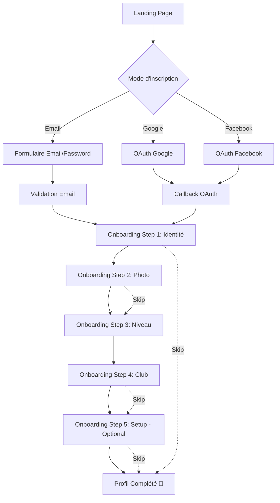
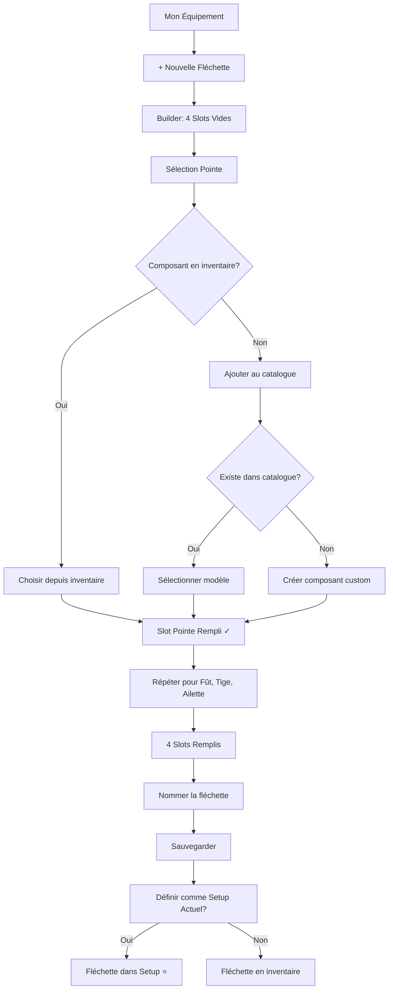
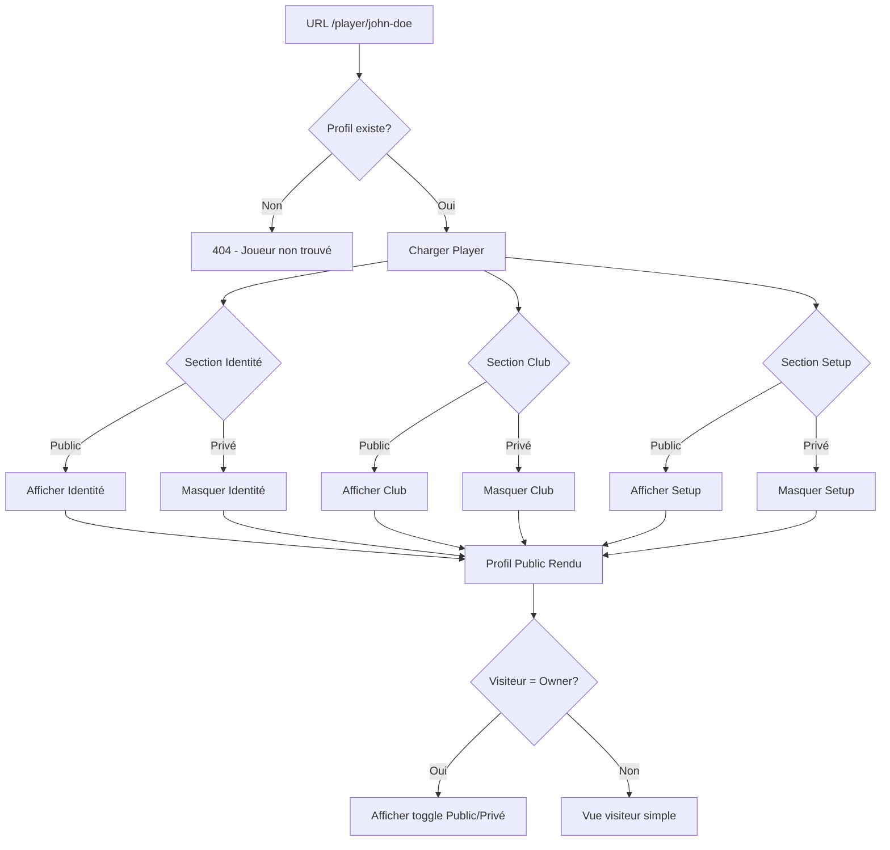
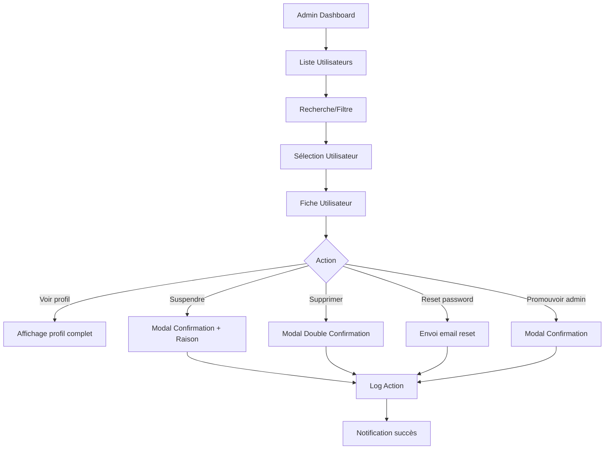

# Darts Community - UI/UX Specification

> **Version:** 1.0
> **Date:** 2026-01-08
> **Status:** Draft
> **Author:** Sally (UX Expert Agent)

---

## 1. Introduction

This document defines the user experience goals, information architecture, user flows, and visual design specifications for **Darts Community**'s user interface. It serves as the foundation for visual design and frontend development, ensuring a cohesive and user-centered experience.

### 1.1 Overall UX Goals & Principles

#### 1.1.1 Target User Personas

| Persona | Description | Primary Context | Key Needs |
|---------|-------------|-----------------|-----------|
| **🎯 Le Joueur Amateur** | Joueur de fléchettes 25-45 ans, membre d'un club FFD, joue 1-5x/semaine. Cherche à professionnaliser son expérience et documenter son matériel. | Mobile au club, Desktop à la maison | Profil rapide, setup facile, partage social |
| **🛠️ L'Admin Club** | Membre du bureau d'un club (bénévole), gère 10-100 membres. Peu de temps disponible. | Desktop principalement | Gestion simple, communication efficace |
| **👑 L'Admin Plateforme** | Owner (Axel) et futurs modérateurs. Gère le catalogue, modère les contenus, supervise les utilisateurs. | Desktop exclusif | Back-office complet, modération rapide |

#### 1.1.2 Usability Goals

| Objectif | Métrique | Cible |
|----------|----------|-------|
| **Facilité d'apprentissage** | Temps pour compléter un profil | < 10 minutes |
| **Efficacité d'usage** | Clics pour modifier le setup | < 3 clics |
| **Prévention d'erreurs** | Taux d'erreurs sur actions critiques | < 2% |
| **Satisfaction utilisateur** | NPS (Net Promoter Score) | > 40 |
| **Mémorabilité** | Réussite après 30 jours d'absence | > 90% |

#### 1.1.3 Design Principles

1. **🎯 Aspiration accessible** — L'interface évoque le professionnalisme des joueurs PDC tout en restant simple pour les amateurs. "Sports card meets social profile."

2. **📱 Mobile-first, desktop-enhanced** — Conçu d'abord pour le joueur au club sur son téléphone, avec une expérience desktop enrichie pour l'édition approfondie.

3. **🪜 Progressive disclosure** — Les fonctionnalités complexes (equipment builder) sont révélées graduellement. L'onboarding guide pas à pas avec options de skip.

4. **⚡ Feedback immédiat** — Chaque action (save, upload, toggle) a une réponse visuelle instantanée via toasts, spinners et transitions.

5. **🇫🇷 French-first** — Interface entièrement en français, patterns culturellement adaptés au public francophone.

### 1.2 Change Log

| Date | Version | Description | Author |
|------|---------|-------------|--------|
| 2026-01-08 | 1.0 | Spécification initiale complète | Sally (UX Expert) |

---

## 2. Information Architecture (IA)

### 2.1 Site Map / Screen Inventory

```mermaid
graph TD
    subgraph "Public"
        HOME[🏠 Landing Page]
        LOGIN[🔐 Login]
        REGISTER[📝 Register]
        PUBLIC_PROFILE[👤 Public Profile /player/slug]
        PRIVACY[📜 Privacy Policy]
        TERMS[📜 Terms of Service]
    end

    subgraph "Authenticated - Player"
        DASHBOARD[📊 Dashboard/Profile View]
        PROFILE_EDIT[✏️ Profile Edit]
        EQUIPMENT[🎯 My Equipment]
        ASSEMBLY[🔧 Dart Assembly Builder]
        SETTINGS[⚙️ Account Settings]
    end

    subgraph "Admin Back-Office"
        ADMIN_DASH[📈 Admin Dashboard]
        ADMIN_USERS[👥 User Management]
        ADMIN_CATALOG[📦 Catalog Management]
        ADMIN_BRANDS[🏷️ Brands]
        ADMIN_COMPONENTS[🔩 Components]
        ADMIN_CLUBS[🏛️ Clubs & Federations]
        ADMIN_MODERATION[🛡️ Content Moderation]
    end

    HOME --> LOGIN
    HOME --> REGISTER
    HOME --> PUBLIC_PROFILE

    LOGIN --> DASHBOARD
    REGISTER --> PROFILE_EDIT

    DASHBOARD --> PROFILE_EDIT
    DASHBOARD --> EQUIPMENT
    DASHBOARD --> SETTINGS

    EQUIPMENT --> ASSEMBLY

    ADMIN_DASH --> ADMIN_USERS
    ADMIN_DASH --> ADMIN_CATALOG
    ADMIN_DASH --> ADMIN_CLUBS
    ADMIN_DASH --> ADMIN_MODERATION

    ADMIN_CATALOG --> ADMIN_BRANDS
    ADMIN_CATALOG --> ADMIN_COMPONENTS
```



### 2.2 Navigation Structure

**Primary Navigation (Header - Authenticated)**

| Item | Route | Icon | Visibility |
|------|-------|------|------------|
| Mon Profil | `/profile` | 👤 | All users |
| Mon Équipement | `/equipment` | 🎯 | All users |
| Paramètres | `/settings` | ⚙️ | All users |
| Admin | `/admin` | 🛡️ | Admins only |

**Primary Navigation (Header - Guest)**

| Item | Route | Icon |
|------|-------|------|
| Accueil | `/` | 🏠 |
| Connexion | `/login` | 🔐 |
| Inscription | `/register` | 📝 |

**Secondary Navigation (Profile Tabs)**

| Tab | Content |
|-----|---------|
| Identité | Infos personnelles, photo, niveau, walk-on song |
| Club | Affiliation, licence, fédération, historique |
| Setup | Fléchettes actuelles, composants |

**Breadcrumb Strategy**

```
Accueil > Mon Équipement > Assemblage > "Match Darts"
Accueil > Admin > Catalogue > Marques > Target
```

---

## 3. User Flows

### 3.1 Flow: Inscription & Onboarding

**User Goal:** Créer un compte et configurer son profil de joueur

**Entry Points:**
- CTA "Créer mon profil" sur landing page
- Bouton "Inscription" dans header

**Success Criteria:** Profil complet avec au moins nom, photo et niveau



**Edge Cases & Error Handling:**
- Email déjà utilisé → Message "Ce compte existe déjà, connectez-vous"
- OAuth échoue → Fallback vers formulaire email avec message explicatif
- Upload photo échoue → Placeholder avatar + message "Réessayez plus tard"
- Session expire pendant onboarding → Sauvegarde automatique, reprise au login

**Notes:** Chaque étape est skippable pour permettre un onboarding rapide. Les étapes manquées sont rappelées via un indicateur de complétion sur le profil.

---

### 3.2 Flow: Configuration du Setup (Equipment Builder)

**User Goal:** Assembler une fléchette complète à partir de composants

**Entry Points:**
- Section "Mon Setup" sur le profil
- Page "Mon Équipement" → "Nouvelle Fléchette"

**Success Criteria:** Fléchette sauvegardée avec 4 composants + nom



**Edge Cases & Error Handling:**
- Composant supprimé de l'inventaire après assemblage → Afficher comme "Composant manquant" avec option de remplacement
- Maximum 3 setups actuels atteint → Message "Retirez un setup actuel d'abord"
- Upload photo composant custom échoue → Placeholder + retry

**Notes:** Le builder doit être utilisable sur mobile. Sur petit écran, les 4 slots s'empilent verticalement avec indicateur de progression.

---

### 3.3 Flow: Consultation Profil Public

**User Goal:** Voir le profil d'un joueur sans être connecté

**Entry Points:**
- URL directe `/player/{slug}`
- Partage sur réseaux sociaux

**Success Criteria:** Affichage des sections publiques uniquement



**Edge Cases & Error Handling:**
- Toutes les sections privées → Message "Ce joueur a choisi de garder son profil privé"
- Profil supprimé (grace period GDPR) → 404 générique
- Walk-on song YouTube/Spotify indisponible → Fallback message "Contenu non disponible"

---

### 3.4 Flow: Administration Utilisateur

**User Goal:** Gérer un compte utilisateur problématique

**Entry Points:**
- Admin Dashboard → Liste utilisateurs
- Recherche par email/nom

**Success Criteria:** Action admin effectuée avec log



---

## 4. Wireframes & Mockups

### 4.1 Design Files

**Primary Design Tool:** Figma (recommandé) ou génération via AI (v0, Lovable)

**Prompt pour génération AI:** Voir section 12 - Annexes

### 4.2 Key Screen Layouts

#### 4.2.1 Landing Page

**Purpose:** Présenter Darts Community et convertir les visiteurs en inscrits

**Key Elements:**
- Hero section avec value proposition en français
- 3 feature cards (Profil, Équipement, Communauté)
- CTA primaire "Créer mon profil gratuitement"
- CTA secondaire "Découvrir un profil" (lien vers profil démo)
- Social proof (compteur utilisateurs, logos clubs partenaires futurs)
- Footer avec liens légaux

**Layout (Mobile):**
```
┌─────────────────────────────┐
│         LOGO                │
│      Darts Community        │
├─────────────────────────────┤
│                             │
│    🎯 Hero Image/Video      │
│                             │
│  "Votre identité de joueur  │
│   comme les pros"           │
│                             │
│  [Créer mon profil]         │
│                             │
├─────────────────────────────┤
│  ┌─────┐ ┌─────┐ ┌─────┐   │
│  │ 👤  │ │ 🎯  │ │ 🏛️  │   │
│  │Profil│ │Setup│ │Club │   │
│  └─────┘ └─────┘ └─────┘   │
├─────────────────────────────┤
│    [Voir un exemple]        │
├─────────────────────────────┤
│         Footer              │
└─────────────────────────────┘
```

**Interaction Notes:**
- Hero avec parallax subtil sur scroll
- Feature cards avec hover animation
- CTA sticky sur mobile après scroll

---

#### 4.2.2 Profile View (Owner)

**Purpose:** Afficher le profil complet du joueur avec options d'édition

**Key Elements:**
- Cover photo (banner style Facebook)
- Avatar overlay sur le cover
- Nom, pseudo, ville, niveau (badge)
- Walk-on song player (embed)
- Tabs: Identité | Club | Setup
- Bouton "Modifier" contextuel par section
- Indicateur de complétion du profil
- Toggle vue "Public" / "Privé"

**Layout (Desktop):**
```
┌────────────────────────────────────────────────────────────┐
│                      COVER PHOTO                           │
│                                                            │
│    ┌──────┐                                                │
│    │AVATAR│                                                │
│    └──────┘                                                │
├────────────────────────────────────────────────────────────┤
│  John "TheDart" Doe          📍 Paris    🎯 Confirmé       │
│  ────────────────────────────────────────────────────────  │
│  [Identité] [Club] [Setup]              [Modifier] [Share] │
├────────────────────────────────────────────────────────────┤
│                                                            │
│  ┌─────────────────────────────────────────────────────┐  │
│  │                SECTION CONTENT                       │  │
│  │                                                      │  │
│  │  Walk-on Song: 🎵 ▶️ [Embed Player]                  │  │
│  │                                                      │  │
│  │  Club: AS Fléchettes Paris                          │  │
│  │  Licence: FFD-12345                                  │  │
│  │                                                      │  │
│  └─────────────────────────────────────────────────────┘  │
│                                                            │
│  ┌─────────────────────────────────────────────────────┐  │
│  │  MON SETUP ACTUEL                           [Edit]   │  │
│  │                                                      │  │
│  │  ┌─────────┐  ┌─────────┐  ┌─────────┐             │  │
│  │  │ Match   │  │ Practice│  │ Backup  │             │  │
│  │  │ Darts   │  │ Darts   │  │ Set     │             │  │
│  │  └─────────┘  └─────────┘  └─────────┘             │  │
│  └─────────────────────────────────────────────────────┘  │
└────────────────────────────────────────────────────────────┘
```

---

#### 4.2.3 Equipment Builder

**Purpose:** Assembler une fléchette en sélectionnant 4 composants

**Key Elements:**
- Visual representation de la fléchette (vertical)
- 4 slots: Pointe → Fût → Tige → Ailette
- Chaque slot: cliquable, état vide/rempli
- Panel de sélection (slide-in sur mobile, sidebar desktop)
- Recherche dans le catalogue
- Option "Ajouter custom"
- Preview de la fléchette assemblée
- Bouton "Sauvegarder"

**Layout (Mobile):**
```
┌─────────────────────────────┐
│  ← Retour    Nouvelle Fléchette    │
├─────────────────────────────┤
│                             │
│         ┌───────┐           │
│         │POINTE │ ← Tap     │
│         │  ✓    │           │
│         └───────┘           │
│             │               │
│         ┌───────┐           │
│         │ FÛT   │ ← Tap     │
│         │  ...  │           │
│         └───────┘           │
│             │               │
│         ┌───────┐           │
│         │ TIGE  │ ← Tap     │
│         │  ...  │           │
│         └───────┘           │
│             │               │
│         ┌───────┐           │
│         │AILETTE│ ← Tap     │
│         │  ...  │           │
│         └───────┘           │
│                             │
├─────────────────────────────┤
│  Nom: [Match Darts_______]  │
│                             │
│  [Sauvegarder]              │
└─────────────────────────────┘

--- Slide-up Panel (on slot tap) ---
┌─────────────────────────────┐
│  Sélectionner une Pointe    │
│  [Rechercher...          🔍]│
├─────────────────────────────┤
│  Mon inventaire             │
│  ┌─────┐ ┌─────┐ ┌─────┐   │
│  │Target│ │Winmau│ │Custom│  │
│  │Storm│ │Prism│ │     │   │
│  └─────┘ └─────┘ └─────┘   │
├─────────────────────────────┤
│  Catalogue                  │
│  [Voir tout →]              │
├─────────────────────────────┤
│  [+ Ajouter composant custom]│
└─────────────────────────────┘
```

---

#### 4.2.4 Admin Dashboard

**Purpose:** Vue d'ensemble des métriques et accès aux fonctions admin

**Key Elements:**
- KPI cards (utilisateurs, inscriptions, profils complets)
- Graphique d'inscriptions (7/30 jours)
- Quick actions (derniers contenus à modérer)
- Navigation vers sections admin

**Layout (Desktop):**
```
┌────────────────────────────────────────────────────────────┐
│  🛡️ Administration                              [Retour]  │
├────────────────────────────────────────────────────────────┤
│                                                            │
│  ┌──────────┐  ┌──────────┐  ┌──────────┐  ┌──────────┐  │
│  │ 156      │  │ 12       │  │ 68%      │  │ 3        │  │
│  │Utilisateurs│ │Cette sem.│ │ Complets │  │À modérer │  │
│  └──────────┘  └──────────┘  └──────────┘  └──────────┘  │
│                                                            │
│  ┌─────────────────────────────────────────────────────┐  │
│  │            📈 Inscriptions (30 jours)                │  │
│  │  ▁▂▃▄▅▆▇█▇▆▅▄▃▂▁▂▃▄▅▆▇█▇▆▅▄▃▂▁                      │  │
│  └─────────────────────────────────────────────────────┘  │
│                                                            │
│  ┌───────────────────┐  ┌───────────────────┐            │
│  │ 👥 Utilisateurs   │  │ 📦 Catalogue      │            │
│  │ Gérer les comptes │  │ Marques & modèles │            │
│  │ [Ouvrir →]        │  │ [Ouvrir →]        │            │
│  └───────────────────┘  └───────────────────┘            │
│                                                            │
│  ┌───────────────────┐  ┌───────────────────┐            │
│  │ 🏛️ Clubs          │  │ 🛡️ Modération     │            │
│  │ Clubs & fédérations│ │ Contenus signalés │            │
│  │ [Ouvrir →]        │  │ [Ouvrir →]        │            │
│  └───────────────────┘  └───────────────────┘            │
└────────────────────────────────────────────────────────────┘
```

---

## 5. Component Library / Design System

### 5.1 Design System Approach

**Approche:** Design system custom basé sur Tailwind CSS utilities, sans framework UI externe.

**Rationale:**
- Tailwind CDN évite le build process
- Composants Blade réutilisables
- Cohérence garantie par tokens CSS

### 5.2 Core Components

#### 5.2.1 Button

**Purpose:** Actions primaires, secondaires et tertiaires

**Variants:**
- `primary` - Fond vert foncé, texte blanc (CTA principal)
- `secondary` - Bordure verte, fond transparent (actions secondaires)
- `ghost` - Texte seul (actions tertiaires, liens)
- `danger` - Fond rouge (actions destructrices)

**States:**
- Default, Hover, Active, Focus, Disabled, Loading

**Usage Guidelines:**
- Un seul bouton `primary` par section
- `danger` toujours avec confirmation modale
- Icône optionnelle à gauche du texte

```html
<x-ui.button variant="primary" icon="save">Sauvegarder</x-ui.button>
<x-ui.button variant="secondary">Annuler</x-ui.button>
<x-ui.button variant="danger" icon="trash">Supprimer</x-ui.button>
```

---

#### 5.2.2 Card

**Purpose:** Conteneur pour groupes d'informations

**Variants:**
- `default` - Fond blanc, ombre légère
- `elevated` - Ombre plus prononcée (mise en avant)
- `interactive` - Hover effect (cliquable)
- `profile` - Layout spécial pour setup/composant

**States:**
- Default, Hover (si interactive), Selected

**Usage Guidelines:**
- Padding interne de 16px (mobile) / 24px (desktop)
- Border-radius de 12px
- Max 3 niveaux de nesting

```html
<x-ui.card title="Mon Setup" subtitle="3 fléchettes">
    {{ $slot }}
</x-ui.card>
```

---

#### 5.2.3 Modal

**Purpose:** Dialogues et confirmations

**Variants:**
- `default` - Modal standard
- `danger` - Header rouge (confirmations destructrices)
- `fullscreen` - Plein écran mobile

**States:**
- Hidden, Visible, Closing (animation)

**Usage Guidelines:**
- Toujours avec overlay sombre
- Close sur clic overlay ou bouton X
- Focus trap à l'intérieur
- ESC pour fermer

---

#### 5.2.4 Form Input

**Purpose:** Saisie de données utilisateur

**Variants:**
- `text` - Input texte standard
- `email` - Validation email
- `password` - Toggle visibility
- `textarea` - Texte multiligne
- `select` - Dropdown natif
- `file` - Upload avec preview

**States:**
- Default, Focus, Filled, Error, Disabled

**Usage Guidelines:**
- Label toujours visible (pas de placeholder-only)
- Message d'erreur sous l'input en rouge
- Helper text optionnel en gris

---

#### 5.2.5 Badge

**Purpose:** Indicateurs de statut ou catégorie

**Variants:**
- `skill` - Niveau joueur (5 couleurs)
- `status` - Actif/Inactif/Suspendu
- `count` - Notification count

**Skill Level Colors:**
| Niveau | Couleur |
|--------|---------|
| Débutant | Gris |
| Amateur | Bleu |
| Confirmé | Vert |
| Semi-pro | Orange |
| Pro | Or (avec effet brillant) |

---

#### 5.2.6 Avatar

**Purpose:** Photo de profil utilisateur

**Variants:**
- `xs` - 24px (listes compactes)
- `sm` - 32px (commentaires)
- `md` - 48px (navigation)
- `lg` - 96px (profil)
- `xl` - 128px (profil hero)

**States:**
- With image, Placeholder (initiales), Loading

---

#### 5.2.7 Toast / Alert

**Purpose:** Notifications et feedback

**Variants:**
- `success` - Vert (action réussie)
- `error` - Rouge (erreur)
- `warning` - Orange (attention)
- `info` - Bleu (information)

**Behavior:**
- Auto-dismiss après 5 secondes
- Dismissible manuellement
- Stack en haut à droite (desktop) / en haut (mobile)

---

#### 5.2.8 Component Card (Equipment)

**Purpose:** Affichage d'un composant de fléchette

**Elements:**
- Image du composant (ou placeholder)
- Marque
- Modèle
- Attributs clés (poids, longueur, etc.)
- Badge "Custom" si applicable

**States:**
- Default, Selected, Disabled

---

#### 5.2.9 Dart Assembly Visual

**Purpose:** Représentation visuelle d'une fléchette assemblée

**Elements:**
- 4 zones cliquables (pointe, fût, tige, ailette)
- Indicateur rempli/vide par zone
- Orientation verticale
- Tooltip au survol avec détails

---

## 6. Branding & Style Guide

### 6.1 Visual Identity

**Brand Guidelines:** À créer - cette section définit les fondations

**Brand Personality:**
- Professionnel mais accessible
- Énergique mais pas agressif
- Communautaire et accueillant
- Moderne avec références au darts traditionnel

### 6.2 Color Palette

| Type | Nom | Hex | RGB | Usage |
|------|-----|-----|-----|-------|
| **Primary** | Dartboard Green | `#1B4D3E` | 27, 77, 62 | CTA, headers, accents principaux |
| **Primary Light** | Forest | `#2D7A5C` | 45, 122, 92 | Hover states, backgrounds légers |
| **Secondary** | Gold | `#D4AF37` | 212, 175, 55 | Highlights, badges Pro, scores |
| **Secondary Light** | Wheat | `#F5DEB3` | 245, 222, 179 | Accents subtils |
| **Accent** | Target Red | `#C41E3A` | 196, 30, 58 | Triple 20, alertes, danger |
| **Success** | Bullseye Green | `#22C55E` | 34, 197, 94 | Confirmations, validations |
| **Warning** | Amber | `#F59E0B` | 245, 158, 11 | Avertissements |
| **Error** | Red | `#EF4444` | 239, 68, 68 | Erreurs, suppressions |
| **Neutral 900** | Charcoal | `#1F2937` | 31, 41, 55 | Texte principal |
| **Neutral 600** | Slate | `#4B5563` | 75, 85, 99 | Texte secondaire |
| **Neutral 300** | Silver | `#D1D5DB` | 209, 213, 219 | Bordures, séparateurs |
| **Neutral 100** | Ghost | `#F3F4F6` | 243, 244, 246 | Backgrounds |
| **Neutral 50** | White | `#FFFFFF` | 255, 255, 255 | Cards, surfaces |

### 6.3 Typography

#### 6.3.1 Font Families

| Usage | Font | Fallback | Source |
|-------|------|----------|--------|
| **Primary (Headings)** | Inter | system-ui, sans-serif | Google Fonts |
| **Secondary (Body)** | Inter | system-ui, sans-serif | Google Fonts |
| **Monospace** | JetBrains Mono | monospace | Google Fonts |

**Note:** Inter est choisi pour sa lisibilité sur écran et sa large gamme de poids.

#### 6.3.2 Type Scale

| Element | Size (Mobile) | Size (Desktop) | Weight | Line Height |
|---------|---------------|----------------|--------|-------------|
| **H1** | 28px | 36px | 700 (Bold) | 1.2 |
| **H2** | 24px | 30px | 700 (Bold) | 1.25 |
| **H3** | 20px | 24px | 600 (Semibold) | 1.3 |
| **H4** | 18px | 20px | 600 (Semibold) | 1.35 |
| **Body** | 16px | 16px | 400 (Regular) | 1.5 |
| **Body Small** | 14px | 14px | 400 (Regular) | 1.5 |
| **Caption** | 12px | 12px | 400 (Regular) | 1.4 |
| **Label** | 14px | 14px | 500 (Medium) | 1.4 |

### 6.4 Iconography

**Icon Library:** Heroicons (MIT License)

**Variants:**
- Outline (24px) - Navigation, actions
- Solid (20px) - États actifs, badges
- Mini (16px) - Inline avec texte

**Custom Icons (à créer):**
- Dart (fléchette)
- Dartboard (cible)
- Component types (pointe, fût, tige, ailette)

**Usage Guidelines:**
- Toujours accompagnés de texte pour les actions principales
- Couleur inherit du parent (currentColor)
- Touch target minimum 44x44px sur mobile

### 6.5 Spacing & Layout

**Spacing Scale (Tailwind):**

| Token | Value | Usage |
|-------|-------|-------|
| `space-1` | 4px | Gaps inline, padding minimal |
| `space-2` | 8px | Gaps petits, padding inputs |
| `space-3` | 12px | Gaps moyens |
| `space-4` | 16px | Padding cards, gaps sections |
| `space-6` | 24px | Margins sections |
| `space-8` | 32px | Gaps grandes sections |
| `space-12` | 48px | Margins page |
| `space-16` | 64px | Hero padding |

**Grid System:**

| Breakpoint | Columns | Gutter | Margin |
|------------|---------|--------|--------|
| Mobile | 4 | 16px | 16px |
| Tablet | 8 | 24px | 32px |
| Desktop | 12 | 24px | 48px |
| Wide | 12 | 32px | auto (max-width: 1280px) |

---

## 7. Accessibility Requirements

### 7.1 Compliance Target

**Standard:** WCAG 2.1 Level AA

**Legal Context:** RGAA (Référentiel Général d'Amélioration de l'Accessibilité) pour conformité française

### 7.2 Key Requirements

#### Visual

| Requirement | Specification |
|-------------|---------------|
| **Color Contrast** | Texte normal: 4.5:1 minimum, Texte large (18px+): 3:1 minimum |
| **Focus Indicators** | Outline visible 2px, offset 2px, couleur contrastée (#1B4D3E) |
| **Text Sizing** | Support zoom 200% sans perte de fonctionnalité |
| **Color Independence** | Information jamais transmise par la couleur seule (+ icônes/texte) |

#### Interaction

| Requirement | Specification |
|-------------|---------------|
| **Keyboard Navigation** | Tous les éléments interactifs accessibles via Tab |
| **Screen Reader** | ARIA labels sur éléments non-textuels, structure de headings |
| **Touch Targets** | Minimum 44x44px sur mobile |
| **Skip Links** | Lien "Aller au contenu" en premier élément |

#### Content

| Requirement | Specification |
|-------------|---------------|
| **Alternative Text** | Alt sur toutes les images informatives, alt="" sur décoratives |
| **Heading Structure** | H1 unique par page, hiérarchie logique H1→H2→H3 |
| **Form Labels** | Label visible + associé programmatiquement, messages d'erreur clairs |
| **Language** | `lang="fr"` sur `<html>`, changements de langue marqués |

### 7.3 Testing Strategy

| Phase | Outils | Fréquence |
|-------|--------|-----------|
| **Développement** | axe DevTools, ESLint a11y plugin | Chaque PR |
| **Review** | WAVE, Lighthouse Accessibility | Chaque sprint |
| **Pre-release** | NVDA/VoiceOver testing manuel | Avant release |
| **Post-release** | Feedback utilisateurs, audits périodiques | Trimestriel |

---

## 8. Responsiveness Strategy

### 8.1 Breakpoints

| Breakpoint | Min Width | Max Width | Target Devices |
|------------|-----------|-----------|----------------|
| **Mobile (sm)** | 0px | 639px | Smartphones portrait |
| **Tablet (md)** | 640px | 1023px | Tablettes, smartphones paysage |
| **Desktop (lg)** | 1024px | 1279px | Laptops, petits écrans |
| **Wide (xl)** | 1280px | - | Desktops, grands écrans |

### 8.2 Adaptation Patterns

#### Layout Changes

| Element | Mobile | Tablet | Desktop |
|---------|--------|--------|---------|
| **Navigation** | Hamburger menu | Hamburger ou horizontal | Horizontal full |
| **Profile tabs** | Swipeable | Horizontal scroll | Tabs fixes |
| **Card grid** | 1 colonne | 2 colonnes | 3-4 colonnes |
| **Equipment builder** | Vertical stacked | Vertical stacked | Horizontal with sidebar |
| **Admin dashboard** | Stacked KPIs | 2x2 grid | 4 colonnes |

#### Navigation Changes

- **Mobile:** Menu hamburger avec slide-in panel
- **Tablet:** Menu hamburger ou nav horizontale condensée
- **Desktop:** Navigation horizontale complète avec dropdown admin

#### Content Priority

| Priority | Mobile | Desktop |
|----------|--------|---------|
| 1 | Avatar + Nom + Niveau | Cover + Avatar + Infos complètes |
| 2 | Setup actuel (cards) | Navigation profil + Setup |
| 3 | Actions (Edit, Share) | Historique club + Walk-on song |
| 4 | Infos détaillées (collapse) | Tout visible |

#### Interaction Changes

| Pattern | Mobile | Desktop |
|---------|--------|---------|
| **Modals** | Fullscreen (bottom sheet) | Centered overlay |
| **Dropdowns** | Native select | Custom dropdown |
| **Tooltips** | Long press ou tap info icon | Hover |
| **Drag & drop** | Touch gestures | Mouse drag |
| **Tables** | Cards ou scroll horizontal | Table complète |

---

## 9. Animation & Micro-interactions

### 9.1 Motion Principles

1. **Purposeful** — Chaque animation a une raison (guider, confirmer, connecter)
2. **Subtle** — Durées courtes, effets discrets, pas de distraction
3. **Performant** — 60fps, utilisation de transform/opacity, respect du prefers-reduced-motion
4. **Consistent** — Mêmes easings et durées dans toute l'app

### 9.2 Key Animations

| Animation | Description | Duration | Easing |
|-----------|-------------|----------|--------|
| **Page transition** | Fade in du contenu | 200ms | ease-out |
| **Modal open** | Scale 0.95→1 + fade | 200ms | ease-out |
| **Modal close** | Scale 1→0.95 + fade | 150ms | ease-in |
| **Toast appear** | Slide in from top + fade | 300ms | ease-out |
| **Toast dismiss** | Slide out + fade | 200ms | ease-in |
| **Button press** | Scale 0.98 | 100ms | ease-out |
| **Card hover** | Lift (translateY -2px) + shadow | 150ms | ease-out |
| **Slot fill** | Scale 0→1 + bounce | 300ms | spring(400, 30) |
| **Tab switch** | Indicator slide | 200ms | ease-in-out |
| **Skeleton pulse** | Opacity 0.5↔1 | 1500ms | ease-in-out (infinite) |
| **Upload progress** | Width 0→100% | variable | linear |
| **Success check** | Draw SVG path | 400ms | ease-out |

### 9.3 Reduced Motion

```css
@media (prefers-reduced-motion: reduce) {
  *, *::before, *::after {
    animation-duration: 0.01ms !important;
    animation-iteration-count: 1 !important;
    transition-duration: 0.01ms !important;
  }
}
```

---

## 10. Performance Considerations

### 10.1 Performance Goals

| Metric | Target | Priority |
|--------|--------|----------|
| **Largest Contentful Paint (LCP)** | < 2.5s | Critical |
| **First Input Delay (FID)** | < 100ms | Critical |
| **Cumulative Layout Shift (CLS)** | < 0.1 | Critical |
| **Time to Interactive (TTI)** | < 3.5s | High |
| **Interaction Response** | < 100ms | High |
| **Animation FPS** | 60fps | Medium |

### 10.2 Design Strategies

#### Images
- **Lazy loading** pour images below-the-fold
- **Responsive images** avec srcset (WebP + fallback JPG)
- **Aspect ratio containers** pour éviter CLS
- **Placeholders** skeleton ou blur-up
- **Max sizes:** Avatar 200KB, Cover 500KB, Composant 100KB

#### Layout
- **CSS containment** sur les cards pour isoler les repaints
- **Fixed dimensions** sur éléments au-dessus du fold
- **Font-display: swap** pour éviter FOIT

#### Interactions
- **Debounce** sur les recherches (300ms)
- **Optimistic UI** pour les toggles et actions rapides
- **Skeleton screens** pendant les chargements

#### Assets
- **Tailwind CDN** (Production: purgé, ~30KB gzipped)
- **Inter font subset** (latin only, ~40KB)
- **Heroicons inline SVG** (no external requests)

---

## 11. Next Steps

### 11.1 Immediate Actions

1. **Valider cette spécification** avec le Product Owner (Axel)
2. **Créer les wireframes haute-fidélité** dans Figma ou via v0/Lovable
3. **Définir les tokens CSS** (variables Tailwind custom)
4. **Prototyper l'Equipment Builder** (composant le plus complexe)
5. **Tester l'onboarding flow** avec 2-3 utilisateurs cibles

### 11.2 Design Handoff Checklist

| Item | Status |
|------|--------|
| ✅ All user flows documented | Complete |
| ✅ Component inventory complete | Complete |
| ✅ Accessibility requirements defined | Complete |
| ✅ Responsive strategy clear | Complete |
| ✅ Brand guidelines incorporated | Complete |
| ✅ Performance goals established | Complete |
| ⬜ High-fidelity mockups in Figma | Pending |
| ⬜ Interactive prototype for Equipment Builder | Pending |
| ⬜ Icon set finalized (custom dart icons) | Pending |

---

## 12. Annexes

### 12.1 Prompt pour génération UI avec v0/Lovable

Voici un prompt optimisé pour générer les écrans principaux avec des outils AI :

```
Create a modern web application UI for "Darts Community", a French platform for amateur darts players.

BRAND:
- Primary color: #1B4D3E (dark green, dartboard feel)
- Secondary color: #D4AF37 (gold, scoring highlights)
- Accent: #C41E3A (target red for alerts)
- Clean, modern sans-serif typography (Inter)
- Card-based layout with subtle shadows
- Mobile-first responsive design

SCREEN TO CREATE: [Landing Page / Profile View / Equipment Builder / Admin Dashboard]

KEY REQUIREMENTS:
- French language interface
- Professional but approachable aesthetic ("sports card meets social profile")
- Tailwind CSS styling
- Accessible (WCAG AA compliant)
- Dark green header with white logo
- Gold accents for highlights and achievements

SPECIFIC ELEMENTS:
[Describe specific elements for the screen]

Output clean HTML with Tailwind classes.
```

### 12.2 Références Design

| Inspiration | Aspect |
|-------------|--------|
| **Strava** | Gamification, profil athlète, stats |
| **LinkedIn** | Structure profil professionnel |
| **Facebook** | Cover photo + avatar layout |
| **PDC.tv** | Énergie du darts professionnel |
| **Dribbble sports profiles** | Visual design moderne |

---

## 13. Checklist Results

### Validation Summary

| Critère | Status | Notes |
|---------|--------|-------|
| User personas defined | ✅ | 3 personas avec contextes |
| Usability goals measurable | ✅ | Métriques cibles définies |
| Design principles clear | ✅ | 5 principes actionnables |
| Information architecture complete | ✅ | Sitemap + navigation |
| Critical user flows documented | ✅ | 4 flows avec edge cases |
| Component library defined | ✅ | 9 composants core |
| Color palette complete | ✅ | 12 couleurs avec usage |
| Typography scale defined | ✅ | 8 niveaux |
| Accessibility requirements | ✅ | WCAG 2.1 AA |
| Responsive breakpoints | ✅ | 4 breakpoints |
| Animation principles | ✅ | 12 animations définies |
| Performance goals | ✅ | Core Web Vitals targets |

### Recommandation

**✅ PRÊT POUR DÉVELOPPEMENT**

Cette spécification couvre tous les aspects UX/UI nécessaires pour commencer le développement frontend. Les prochaines étapes sont :

1. Créer les mockups haute-fidélité (optionnel mais recommandé pour l'Equipment Builder)
2. Passer au Scrum Master (`/sm`) pour la planification du Sprint 1
3. Le développeur peut commencer avec les composants Blade de base

---

*Document généré le 2026-01-08 par Sally (UX Expert Agent)*
*Darts Community - UI/UX Specification v1.0*
